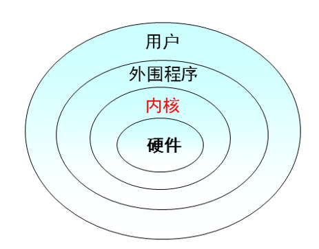
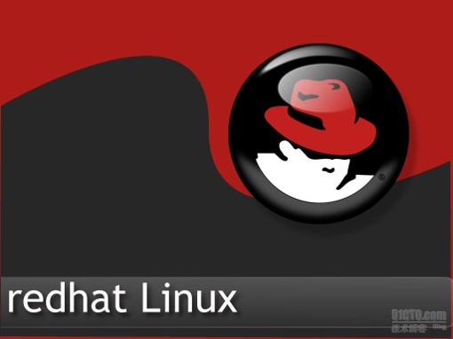
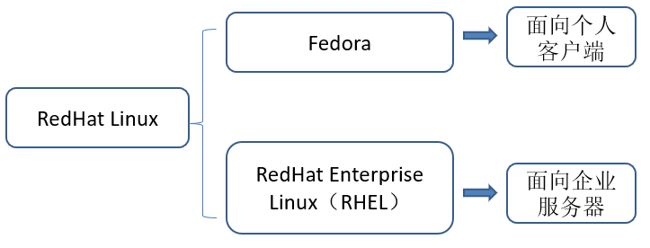
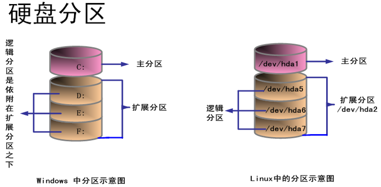
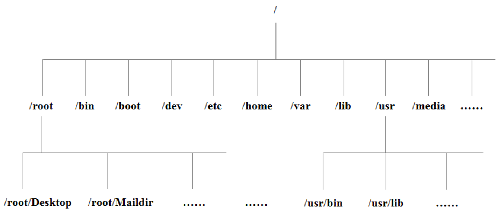
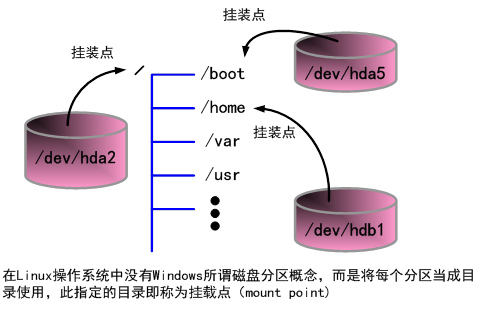
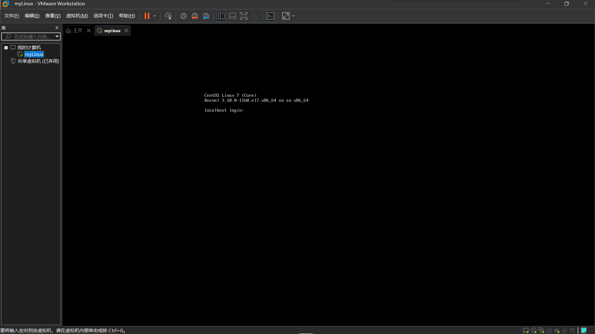
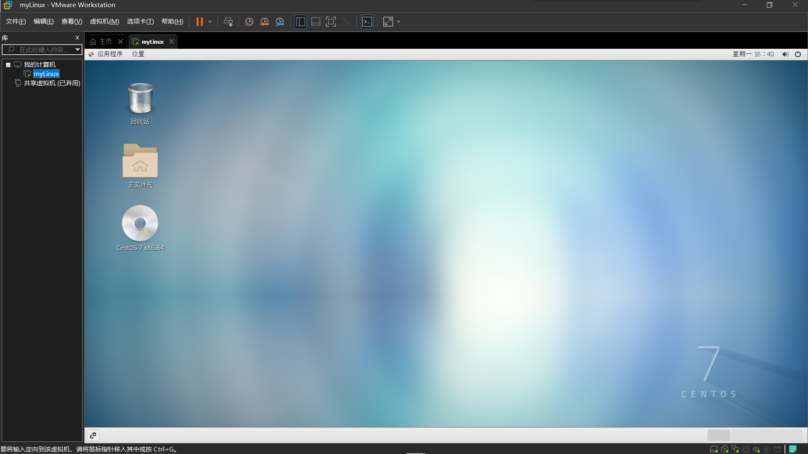
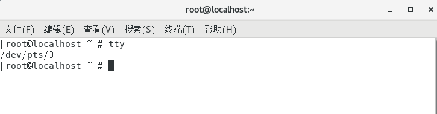
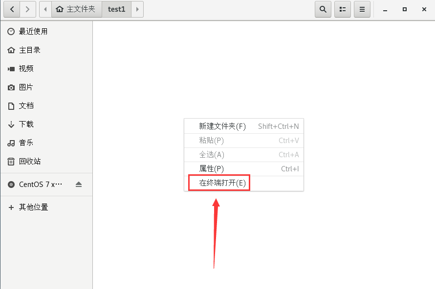

# 操作系统  
简单的来说，操作系统主要分为两个东西，一个是内核、一个是一堆核心提供的工具、这一堆工具组成的就是所谓的操作系统。  

内核负责控制硬件资源分配，而如果只有内核，则只能让计算机硬件运行，而不能有任何功能，因此需要系统调用提供给开发者使用，从而开发应用程序；内核能够控制硬件，比如：让CPU可以运算、让硬盘可以读写数据等；只有内核的话，只能让计算机运行，但是我们不能控制计算机。  

而系统调用是操作系统提供给开发者的调用接口。任何硬件都不会默认就被操作系统控制，而需要开发商根据操作系统提供的接口开发驱动程序，只有安装了驱动程序才能够控制硬件设备。  

# Linux的发展历史

UNIX于1969年诞生于美国Bell实验室  

1973年，Dennis Ritchie和Ken Thompson发明了C语言，而后写出了Unix的内核  

1977年，Berkeley大学的Bill Joy针对他的机器修改Unix源码，称为BSD（BerkeleySoftware Distribution）    

1979年，Unix发布System V，用于个人计算机  

1984年，因为Unix规定：“不能对学生提供源码”，Tanenbaum老师自己编写兼容于Unix的Minix，用于教学  

1984年，Stallman开始GNU（GNU's NotUnix）项目，创办FSF（Free Software Foundation）基金会


1985年，为了避免GNU开发的自由软件被其他人用作专利软件，因此创建GPL（General Public License）版权声明

1988年，MIT为了开发GUI，成立了XFree86的组织

1991年，芬兰赫尔辛基大学的研究生LinusTorvalds基于gcc、bash开发了针对386机器的Lniux内核

1994年，Torvalds发布Linux-v1.0

1996年，Torvalds发布Linux-v2.0，确定了Linux的吉祥物：企鹅  

#  Linux系统内核Kernel

系统内核就是负责完成操作系统最基本功能的程序。
系统内核的主要作用就是负责管理计算机中的硬件资源、提供用户操作界面、提供应用程序的执行环境。  

  

# Linux Kernel版本号

Linux的内核版本分为稳定版本和开发版本；

此版本如果是偶数，则为稳定版本，如果是奇数，则为开发版本，内核开发人员使用；

释放版本为对次版本的改动，即加入一些功能；

修改版本为编译的次数，每次加一；  

  


# GNU计划  

Kernel只能实现系统最基本的功能，一个完整的Linux系统应该包括Kernel和应用程序两部分。  

无论Linux的Kernel还是Linux中的应用程序，它们都具有一个共同的特点——都属于一个名为GNU的计划项目，都要遵守GNU计划中的GPL或LGPL协议。  

GNU是世界知名的自由软件项目，正是它决定了Linux系统自由开放的属性。  

GNU计划是由Richard Stallman于1984年发起并创建的，他认为：对于整个人类，知识传播的过程应该是开放的，计算机软件作为人类智慧的结晶，也是知识的一种，所以它应以源代码的方式呈现，没有人可以独占。    

凡属于GNU计划中的软件都是开放源代码的，任何人都可以自由地去使用、修改或传播这些软件。而且为了为保证GUN计划内的软件经传播、改写以后仍然具有“自由”特性  

GNU计划logo以及发起人Stallman  


Linux系统的内核Kernel以及Linux系统中的绝大多数应用软件都来自于GNU计划，任何人都可以自由地去使用、传播它们，因此Linux系统的确切名称应该为“GNU/Linux操作系统”。  

正是由于Linux自由开源的特性，才造就了目前各种不同的Linux发行版本百花齐放的局面。

# Linux的发行版本  

Linux发行版就是指在Linux内核的基础之上添加上各种管理工具和应用软件，这就构成了一个完整的操作系统。  

根据GNU的相关协议，任何公司或社团甚至是个人都可以将Linux内核和各种自由软件打包成一个完整的Linux发行版。  
目前各种Linux发行版加起来已有300个。  
虽然每个Linux发行版都有单独的名称，但其实它们所采用的Linux内核和使用的软件包都是基本类似的。  

在各种Linux发行版中最为知名的是Red Hat Linux。  

  



# CentOS 

CentOS是RHEL的再编译版本，也就是抹去了RHEL系统中Red Hat的标识信息，其功能和使用与RHEL基本是一致的。  相当于是免费版的RHEL。


# ubuntu

Ubuntu主要是面向个人用户，是一个用于桌面环境的Linux系统。  


# Linux系统的特点  

Linux系统最主要的特点就是开源。按照GNU的规定，不仅Linux系统本身是开源的，在Linux系统核心上开发的软件也必须开源。  

Linux系统本身也比较稳定，安全性相对较高，对系统资源占用也比较少。    

Linux的缺点是没有特定的赞助商，可以在Linux系统上运行的软件并不丰富，而且其图形界面也做的不够好，系统操作主要依靠命令进行，提高了Linux系统的使用门槛。  

目前Linux系统主要应用于服务器和嵌入式系统两个方面。  

***

# 文件系统  

文件系统是一种用于向用户提供底层数据访问的机制。它将设备中的空间划分为特定大小的块（扇区），一般每块512字节。数据存储在这些块中，大小被修正为占用整数个块。由文件系统软件来负责将这些块组织为文件和目录，并记录哪些块被分配给了哪个文件，以及哪些块没有被使用。  

不过，文件系统并不一定只在特定存储设备上出现。它是数据的组织者和提供者，至于它的底层，可以是磁盘，也可以是其它动态生成数据的设备（比如网络设备）。  

## 磁盘文件系统

磁盘文件系统是一种设计用来利用数据存储设备来保存计算机文件的文件系统，最常用的数据存储设备是磁盘驱动器，可以直接或者间接地连接到计算机上。例如：FAT、 exFAT、NTFS、HFS、HFS+、ext2、ext3、ext4、ODS-5、btrfs。有些文件系统是进程文件系统（也有译作日志文件系统）或者追踪文件系统。  


## 光盘  

ISO 9660和UDF被用于CD、DVD与蓝光光盘。  

## 闪存文件系统  

闪存文件系统是一种设计用来在闪存上储存文件的文件系统。随着移动设备的普及和闪存容量的增加，这类文件系统越来越流行。  

##  数据库文件系统

文件管理方面的一个新概念是一种基于数据库的文件系统的概念。不再（或者不仅仅）使用分层结构管理，文件按照他们的特征进行区分，如文件类型、专题、作者或者亚数据进行区分。于是文件检索就可以按照SQL风格甚至自然语言风格进行。

例如BFS和WinFS。 

## 网络文件系统

网络文件系统（NFS，NetworkFile System）是一种将远程主机上的分区（目录）经网络挂载到本地系统的一种机制。  

***

在Linux下所有的设备、所有的文件、所有的你知道的东西都是文件！文件在他看来有两种：一种是字符型式的、一种是二进制形式的。键盘在他看来是字符设备、打印机也是字符设备、硬盘、U盘光驱是块设备、就是读取数据的时候一块一块的读取。Linux管理任何东西都是以文件的形式、编程简单。只针对文件系统编程。、它提供了一个VFS——virturlfilesystem 虚拟文件系统。它可以针对不同的文件系统进行读写、这样的好处就是简化编程、和Java的跨平台是不是很像？提供统一接口、在不同的平台上都能运行。

随着Linux的不断发展，它所支持的文件格式系统也在迅速扩充，Linux系统核心可以支持十多种文件系统类型：Btrfs、JFS、 ReiserFS、ext、ext2、ext3、ext4、ISO9660、XFS、Minx、MSDOS、UMSDOS、VFAT、NTFS、HPFS、NFS、SMB、SysV、PROC等。

# 硬盘简介 

## 硬盘物理组成

就硬盘的物理组件来说，硬盘其实是由许许多多的圆形硬盘片所组成的，依据硬盘片能够容纳的数据量，而有所谓的单碟(一块硬盘里面只有一个硬盘片)或者是多碟(一块硬盘里面含有多个硬盘片)的硬盘。

硬盘里有磁头（head）在硬盘上读写，磁头固定在机械手臂上，机械手臂上有多个磁头，可以进行读取。当磁头固定不动时（假设机械手臂在动），硬盘转一圈所画出来的圆就是磁道（track）。两个硬盘片上的同一个磁道就是一个柱面，这个柱面也是分区时最小单位：由圆心向外画直线，可以将磁道再细分为扇区，扇区就是硬盘片上的最小的存储物理量。通常，一个扇区的大小约为512字节。这些就是整个硬盘的基本组成。

## 硬盘接口

硬盘接口是硬盘与主机系统间的连接部件，作用是在硬盘缓存和主机内存之间传输数据。不同的硬盘接口决定着硬盘与计算机之间的连接速度，在整个系统中，硬盘接口的优劣直接影响着程序运行快慢和系统性能好坏。从整体的角度上，硬盘接口分为IDE、SATA、SCSI和光纤通道四种，IDE接口硬盘多用于家用产品中，也部分应用于服务器，SCSI接口的硬盘则主要应用于服务器市场，而光纤通道只在高端服务器上，价格昂贵。SATA是种新生的硬盘接口类型，还正出于市场普及阶段，在家用市场中有着广泛的前景。在IDE和SCSI的大类别下，又可以分出多种具体的接口类型，又各自拥有不同的技术规范，具备不同的传输速度，比如ATA100和SATA；Ultra160SCSI和Ultra320SCSI都代表着一种具体的硬盘接口，各自的速度差异也较大。

### IDE

IDE的英文全称为“IntegratedDriveElectronics”，即“电子集成驱动器”，它的本意是指把“硬盘控制器”与“盘体”集成在一起的硬盘驱动器。把盘体与控制器集成在一起的做法减少了硬盘接口的电缆数目与长度，数据传输的可靠性得到了增强，硬盘制造起来变得更容易，因为硬盘生产厂商不需要再担心自己的硬盘是否与其它厂商生产的控制器兼容。对用户而言，硬盘安装起来也更为方便。IDE这一接口技术从诞生至今就一直在不断发展，性能也不断的提高，其拥有的价格低廉、兼容性强的特点，为其造就了其它类型硬盘无法替代的地位。

### SCSI

SCSI的英文全称为“SmallComputerSystem Interface”（小型计算机系统接口），是同IDE（ATA）完全不同的接口，IDE接口是普通PC的标准接口，而SCSI并不是专门为硬盘设计的接口，是一种广泛应用于小型机上的高速数据传输技术。SCSI接口具有应用范围广、多任务、带宽大、CPU占用率低，以及热插拔等优点，但较高的价格使得它很难如IDE硬盘般普及，因此SCSI硬盘主要应用于中、高端服务器和高档工作站中。


## MBR（Master bootRecord）

MBR位于硬盘的第一个物理扇区（绝对扇区）柱面0、磁头0、扇区1处，MBR中包含硬盘的主引导程序和硬盘分区表。是一个磁盘最重要的部分、如果这部分坏掉、则整个磁盘都报废。

***
# Linux磁盘分区和目录结构  

硬盘分区包括主分区、扩展分区、逻辑分区三种类型。  
因为在硬盘的主引导扇区中用来存放分区信息的空间只有64个字节，而每一个分区的信息都要占用16字节空间，因而理论上一块磁盘最多只能拥有4个分区，这4个分区都是主分区。  
扩展分区也是主分区，但是在扩展分区中可以再创建新的分区，这些分区就被称为逻辑分区，逻辑分区的数量就不再受主引导扇区空间大小的限制。  

在Linux系统中所有的磁盘以及磁盘中的每个分区都是用文件的形式来表示的。
比如电脑中有一块硬盘，硬盘上划分了3个分区，那么在Linux系统中就会有相应的4个设备文件，一个是硬盘的设备文件，另外每个分区也有一个设备文件，所有的设备文件都统一存放在/dev目录中。  

不同类型的硬盘和分区的设备文件命名都有统一的规则  

IDE接口的硬盘设备，表示为“hdX”形式的文件名，  
SATA或SCSI接口的硬盘设备，表示为“sdX”形式文件名。  
其中“X”可以为a、b、c、d等字母序号。  
例如，将系统中的第1个IDE设备表示为“hda”，将第2个SATA设备表示为“sdb”。	

由于主分区的数目最多只有四个，因此主分区和扩展分区的序号也就限制在1~4之间，而逻辑分区的序号将始终从5开始。  
例如，即便第1个IDE硬盘中只划分了一个主分区、一个扩展分区，则新建的第1个逻辑分区的序号仍然是从5开始，应表示为“sda5”，第2个逻辑分区表示为“sda6”。

  



## Linux文件系统

在Linux系统中，硬盘分区则大都是采用EXT4文件系统。

## 交换分区

Linux中还有一个比较特殊的SWAP类型的文件系统，专门给交换分区。
交换分区类似于Windows系统中的虚拟内存，能够在一定程度上缓解物理内存不足的问题。  
在Windows系统中是采用一个名为pagefile.sys的系统文件作为虚拟内存使用，而在Linux系统中则是划分了一个单独的分区作为虚拟内存，这个分区就被称为交换分区。
交换分区的大小通常设置为主机物理内存的2倍，如主机的物理内存大小为1GB，则交换分区大小设置为2GB即可。

## Linux的目录结构

在Linux系统中，将所有的目录和文件数据组织为一个树型的目录结构，整个系统中只存在一个根目录，所有的分区、目录、文件都在同一个根目录下面。

在Linux系统中定位文件或目录位置时，使用“/”进行分隔。
在整个树型目录结构中，使用独立的一个“/”表示根目录，根目录是Linux文件系统的起点。  
在根目录下面按用途不同划分有很多子目录。

  

一个硬盘分区只有挂载到某个目录中才能被访问，这个指定的目录就被称为挂载点。例如将分区“/dev/hda2”挂载到根目录“/”，那么通过访问根目录“/”就可以访问到“/dev/hda2”分区，这个分区也就称为根分区。



/boot：存放Linux系统启动所必需的文件，出于系统安全考虑，/boot目录通常被划分为独立的分区。  
/etc：存放Linux系统和各种程序的配置文件。  
/dev：存放Linux系统中的硬盘、光驱等硬件设备文件。  
/bin：存放Linux系统中最常用的基本命令。  
/sbin：存放Linux系统基本的管理命令。  
/usr：安装软件的默认存放位置，类似于Windows中的Program Files目录。  
/home：用户主目录（也称为家目录），类似于Windows中的用户配置文件夹。  
/mnt：一般是空的，用来临时挂载别的文件系统。  

# Linux的图形界面

Linux系统的桌面环境称为X Window，负责提供X Window桌面环境的软件有两个：GNOME和KDE。  
GNOME源自美国，是GNU计划的重要组成部分，而KDE源自德国，RHEL以GNOME作为默认的桌面环境。

# Shell简介

Shell是指系统的用户界面，它为用户与系统内核进行交互操作提供了一种接口。  
图形界面的Shell称为GUI（Graphic User Interface）  
字符界面的Shell称为CLI（Command Line Interface）

由于Linux系统的操作以字符界面为主，因而Shell通常都是专指字符界面CLI。

Shell其实也是Linux系统中的一个应用程序，它将用户输入的命令解释成系统内核能理解的语言，命令执行之后再将结果以用户可以理解的方式显示出来。
Linux系统中负责提供Shell功能的软件有：SH、Csh、Zsh……

在CentOS系统中默认使用的Shell称为Bash，这也是目前应用最为广泛的一种Shell。

# Shell的启动

在CentOS中可以通过虚拟终端的方式启动Shell，虚拟终端可以为用户提供多个互不干扰、独立工作的界面。

CentOS中提供的虚拟终端默认有6个，其中第1个是图形界面，第2到6个则是字符界面。
可以通过Ctrl+Alt+F(1~6)组合键在不同的虚拟终端之间进行切换

*在主页面按Ctrl+Alt+F2：*



*在主页面按Ctrl+Alt+F1：*



在CentOS中可以通过虚拟终端的方式启动Shell，虚拟终端可以为用户提供多个互不干扰、独立工作的界面。

虚拟终端的缩写为tty，在字符界面下执行“tty”命令就可以显示用户目前所在的虚拟终端。
```bash
[root@localhost ~]# tty
```


除了虚拟终端之外，还有一种启动Shell的方式称为模拟终端，缩写为pts。

比如图形界面中的“在终端中打开”和利用putty远程登录，所打开的都是模拟终端。

 

# 命令提示符

**[root@localhost ~]#**

“root”表示当前登录的用户账户名；  

“localhost”表示本机的主机名；  

“~”代表我们当前所在的位置，也就是工作目录;  

“~”泛指用户的家目录，root用户的家目录就是/root;  

“#”表示当前登录的是管理员用户，如果登录的是普通用户，则最后的“#”字符将变为“$。

按Ctrl+C组合键可以中断命令的运行

# Shell命令格式

**命令名 [选项] [参数]**

命令名是描述命令功能的英文单词或缩写，命令名必不可少，并且总是放在整个命令行的起始位置。  
选项用于调节命令的具体功能，同一命令采用不同的选项，其功能各不相同。选项可以有一个，也可以有多个。选项通常以“-”开头，当有多个选项时，可以只使用一个“-”符号，如“ls –l –a”命令与“ls –al”命令功能完全相同。  
参数是命令的处理对象，通常情况下参数可以是文件名、目录名或用户名等内容。

在Shell中，一行中可以键入多条命令，命令之间用“;”字符分隔。
如果在一行命令后加上“\”符号，就表示另起一行继续输入。

Linux中命令区分大小写，同一个命令，大写和小写代表不同的含义。
可以使用Tab键对命令或文件名自动补齐，以简化输入。
通过上下方向键可以找出曾执行过的历史命令。

# 关机命令shutdown

使用shutdown命令重启系统  
```bash
[root@localhost ~]# shutdown –r now 
```
使用shutdown命令关闭系统  
```bash
[root@localhost ~]# shutdown –h now  
```
使用shutdown命令设置在15分钟以后自动重启系统  
```bash
[root@localhost ~]# shutdown –r +15 
```
# 重启命令reboot
使用reboot命令重启系统
```bash
[root@localhost ~]# reboot 
```
