# 用户和组的概念

## 用户账号的类型

超级用户：root。不建议直接用root用户登录系统，当进行系统管理、维护任务时，可以切换到root用户。  

普通用户：普通用户账号需要由root用户或其他管理员用户创建，拥有的权限受到一定限制，一般只在用户自己的家目录中有完全权限。

普通用户：普通用户账号需要由root用户或其他管理员用户创建，拥有的权限受到一定限制，一般只在用户自己的家目录中有完全权限。

## 基本组

每一个用户账号至少属于一个组，这个组称为该用户的基本组。在Linux系统中每创建一个用户账号就会自动创建一个与该账号同名的用户组。
比如创建了一个名为“student”的普通用户账号，那么同时也将自动创建一个名为“student”的用户组。“student”用户默认就属于“student”组，这个组也就是“student”用户的基本组。

## 附加组

在Linux系统中，每个用户可以同时加入多个组，这些用户又另外加入的组就称为该用户的附加组。  
例如，将用户student再加入到邮件管理员组mailadm，那么student就同时属于student、mailadm组，student是其基本组，而mailadm是其附加组。

## UID和GID

UID（用户ID）是Linux系统中每一个用户账号的唯一标识符。
* root用户的UID为固定值0，
* 系统用户账号的UID默认在1~499之间
* 500~60000的UID号默认分配给普通用户账号使用。

每一个组也有一个数字形式的标识符，称为GID（组ID）。
* root组的GID为固定值0，
* 系统组账号的GID默认在1~499之间，
* 普通组账号的GID默认为500~60000。

## 用户账号文件

与用户账号相关的配置文件主要有两个：
* /etc/passwd：保存用户名称、主目录、登录Shell等信息
* /etc/shadow：保存用户的密码、账号有效期等信息。 

### /etc/passwd文件内容
使用vi编辑器打开,进入末行模式通过set nu 查看多少行
```bash
vi /etc/passwd
:set nu
```
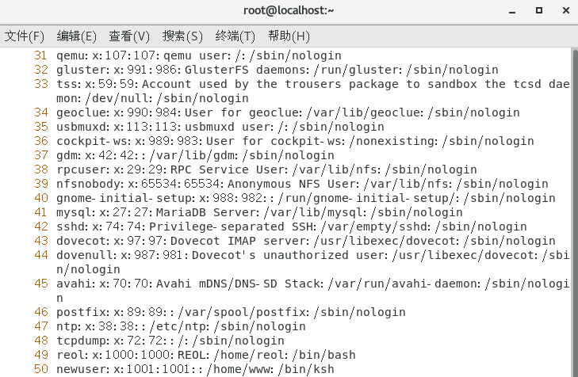

前48行默认的系统用户，也称虚拟账户，第49行为安装操作系统是创建的用户，往后为新建的用户
   
root:x:0:0:root:/root:/bin/bash 
* 第1个字段：用户名。
* 第2个字段：密码占位符x。
* 第3个字段：-u 用户的UID。
* 第4字段：-g 用户所属组的GID。
* 第5字段：-c 用户全名，注释等。-c ps: 配置文件中“:”为间隔符，在写注释时应避免使用
* 第6字段：-d 用户家目录。
* 第7字段：-s 用户登录所用的shell类型。

### 查看/etc/shadow文件
```bash
ll /etc/shadow
```
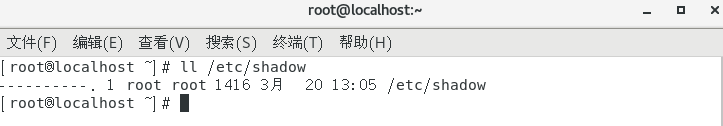
所有用户对其没有任何权限
```bash
tail -3 /etc/shadow
```
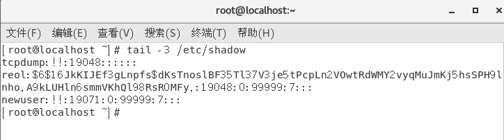
文件对密码进行加密显示  
若没有设置密码，则显示 “!!”
## 查看用户身份标识信息

通过id命令查看用户所属的基本组和附加组信息。
```bash
id reol
```
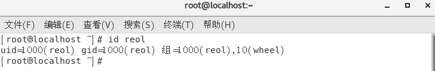
 
“gid”部分表示用户所属的基本组  
“组”部分表示用户所属的基本组和附加组 

## 组账号文件

/etc/group：保存组账号名称、GID号、组成员等信息    
/etc/gshadow：保存组账号的加密密码字串等信息

### 查看/etc/group文件
```bash
vi /etc/group
```
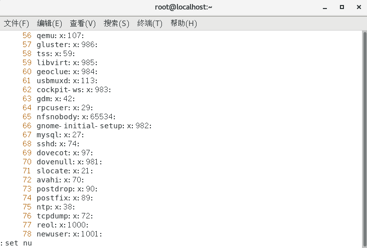

root:x:0:
* 第一列：组名
* 第二列：密码标志位
* 第三列：该组的id
* 第四列：该组的成员（若该组为基本组，成员不列出来；若为附属组，依次列出成员，成员之间用逗号隔开）

```bash  
grep "^adm" /etc/group     
#输出
adm:x:4:adm,daemon
```

# 用户命令管理

## 管理用户
* useradd [选项] 用户名   --创建用户
* userdel [选项] 用户名   --删除用户
* usermod [选项] 用户名   --修改用户
* passwd [选项] 用户名    --为用户设置密码
* su [-] 用户名           --切换用户

## useradd命令——创建用户
添加用户账号时系统会自动完成以下几项任务：
* 在“/etc/passwd”文件和“etc/shadow”文件的末尾增加该用户账号的记录。
* 若未指明用户的主目录，则在“/home”目录下自动创建与该用户账号同名的主目录，并在该目录中建立用户的初始配置文件。
* 若未指明用户所属的组，则自动创建与该用户账号同名的基本组账号，组账号的记录信息保存在“etc/group”、“etc/gshadow”文件中。

-u选项：指定用户的UID，要求该UID号未被其他用户使用。

    [root@localhost ~]# useradd -u 504 user2
    创建名为user2的用户账号，并将其UID指定为504。
-c选项：给新用户添加注释等

    [root@localhost ~]# useradd -c 好困 lazy
-d选项：指定用户的家目录。

    [root@localhost ~]# useradd -d /admin admin
-g选项：指定用户的基本组。

    [root@localhost ~]# useradd -g admin user4
-G选项：指定用户的附加组。

    [root@localhost ~]# useradd -G root user5
-e选项：指定用户账号的失效时间，可以使用yyyy-mm-dd的日期格式。

    [root@localhost ~]# useradd -g users -e 2014-01-30 temp01
-m选项：建立用户家目录。
-M选项：不建立用户家目录。  
-s选项：指定用户的登录shell，如果将shell指定为/sbin/nologin，那么该用户将禁止登录

    [root@localhost ~]# useradd -s /sbin/nologin -M ftpuser
## passwd命令——为用户账号设置密码
用户账号，还必须为其设置一个密码才能用来登录Linux系统。

    [root@localhost ~]# passwd user1 
Linux系统对密码要求非常严格，要求密码硬符合下列规则：
* 密码不能与用户账号相同
* 密码长度最好在8位以上
* 密码最好不要使用字典里面出现的单词或一些相近的词汇，如Passw0rd等
* 密码最好要包含英文大小写、数字、符号这些字符。  

“RedHat2013”才是一个符合要求的密码。

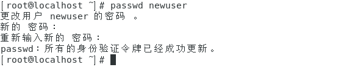

-d选项，清空密码

    [root@localhost ~]# passwd -d user1
-l选项，锁定用户账号(仅限root)

    [root@localhost ~]# passwd -l user2
-u选项，解锁用户账号(仅限root)

    [root@localhost ~]# passwd -u user2
-f选项，强迫用户下次登录时必须修改口令  
-x选项，指定口令最长存活期
## userdel命令——删除用户账号

    [root@localhost ~]# userdel user1
user1的账号虽然被删除了，但是他的家目录仍然还在。

-r选项，删除用户时，将用户的家目录一并删除。  
## usermod命令——修改用户账号属性

-c选项，修改用户帐号的备注文字。   

     usermod -c 好困 root
-d选项，修改用户的家目录。  

     usermod -d /home/hnlinux root
-l选项，更改用户账号的名称。  

     usermod -l reol root
-L选项，锁定用户密码，使密码无效。    

    usermod -L reol 
-g选项，更改用户的基本组。   
-G选项，更改用户的附加组。     
-s选项，修改用户登入后所使用的shell。  
-u选项，修改用户ID。   
-U选项，解除密码锁定。 
# 组命令管理
## 管理组
* groupadd [选项] 组名    --创建用户组   
* groupdel [选项] 组名     --删除用户组   
* groupmod [选项] 新组名 组名    --修改用户组
* gpasswd [选项] 用户名  组名  -- 添加、删除组成员       
* groups        查询某个用户账号所属的组     

## 创建组groupadd

    [root@localhost ~]# groupadd Reol
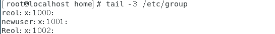

-g 指定组的GID,该GID必须唯一，不能和其他用户组的GID重复  
-o 一般与-g选项同时使用，表示新用户组的GID可以与系统已有用户组的GID相同

## 删除组groupdel

    [root@localhost home]# groupdel Reol
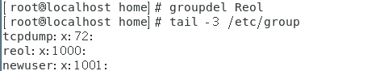

## 修改组groupmod
-n选项，修改组名

    [root@localhost home]# groupmod -n Reol reol
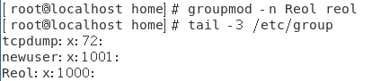

-g选项，修改组的gid

    [root@localhost home]# groupmod -g 1105 reol

## gpasswd命令——将一个用户添加到组或者从组中删除

-a：添加用户到组； 

    [root@localhost ~]# gpasswd -a user1 group1
-d：从组删除用户；  

    [root@localhost ~]# gpasswd -d user1 group1
-A：指定管理员；  
-M：指定组成员和-A的用途差不多，替换该组内所有成员

    [root@localhost ~]# gpasswd -M user2,user3 group1
-r：删除密码；   
-R：限制用户登入组，只有组中的成员才可以用newgrp加入该组。

##  groups命令——查询当前用户的属组

    [root@localhost ~]# groups
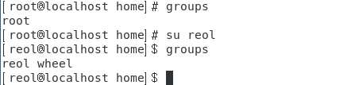

## newgrp——登入另一个群组

    [root@localhost ~]# newgrp root

# 文件权限管理
每一个文件或目录都有以下两种属性：   
访问权限
* 读取(r )：允许查看文件内容、显示目录列表
* 写入(w)：允许修改文件内容，允许在目录中新建、移动、删除文件或子目录
* 可执行(x)：允许运行程序、切换目录

归属（所有权）
* 属主：拥有该文件或目录的用户帐号
* 属组：拥有该文件或目录的组帐号

## 查看文件/目录的权限和归属

    [root@localhost ~]# ls -l install.log

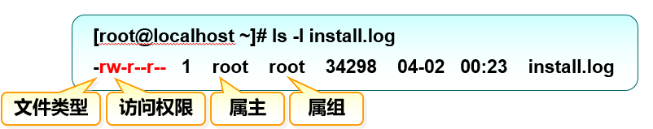

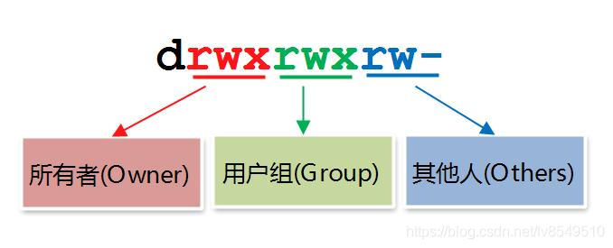

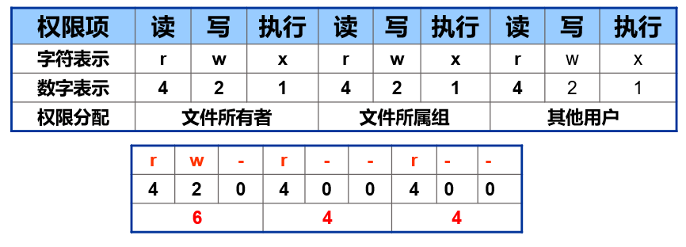

## 设置文件/目录的权限——chmod命令

chmod   [ugoa]  [+-=]  [rwx]  文件或目录
* u、g、o、a 分别表示属主、属组、其他用户、所有用户 
* +、-、= 分别表示增加、去除、设置权限
* r、w、x 对应的权限字符

chmod nnn 文件或目录
* nnn是三位八进制数
  
选项：
* -c : 若该文件权限确实已经更改，才显示其更改动作
* -f : 若该文件权限无法被更改也不要显示错误讯息
* -v : 显示权限变更的详细资料
* -R : 对目前目录下的所有文件与子目录进行相同的权限变更(即以递归的方式逐个变更)

## 设置文件/目录的归属——chown命令

chown  属主   文件或目录  
chown  :属组  文件或目录   
chown  属主:属组  文件或目录

选项：
* -c : 显示更改的部分的信息
* -f : 忽略错误信息
* -h :修复符号链接
* -v : 显示详细的处理信息
* -R : 处理指定目录以及其子目录下的所有文件

```bash
#把 /var/run/httpd.pid 的属主设置 root：
chown root /var/run/httpd.pid
#将文件 file1.txt 的属主设为 runoob，属组 runoobgroup :
chown runoob:runoobgroup file1.txt
#将当前前目录下的所有文件与子目录的属主皆设为 runoob，属组 runoobgroup:
chown -R runoob:runoobgroup *
#把 /home/runoob 的属组设置为 512 （关联组ID），不改变所有者：
chown :512 /home/runoob
```

## 使用附加权限
SET位权限
+ 主要用途：  
    + 为可执行（有 x 权限的）文件设置，权限字符为“s”  
    + 其他用户执行该文件时，将拥有属主或属组用户的权限  
+ SET位权限类型：  
    + SUID：表示对属主用户增加SET位权限   
    + SGID：表示对属组内的用户增加SET位权限    
    + 如果SGID是设定在目录上面，则在该目录内所建立的文件或目录的所属组，将会自动成为此目录的所属组。

粘滞位权限（Sticky）
+ 主要用途：
    + 为公共目录（例如，权限为777的）设置，权限字符为“t”
    + 用户不能删除该目录中其他用户的文件

设置SET位、粘滞位权限
+ 使用权限字符
    + chmod  ug±s  可执行文件...
    + chmod  o±t  目录名...
+ 使用权限数字：
    + chmod  mnnn  可执行文件...
    + m为4时，对应SUID，2对应SGID，1对应粘滞位，可叠加
  
注意事项：
* SUID的作用仅针对于二进制程序，且使用者对该二制程序有“X”权限，以“文件拥有者”的身份只在执行过程中有效。
* SGID主要用在目录上，若用户在此目录有W权限，则在此目录下建立新文件时新文件的群组与此目录的群组相同。
* SBIT只针对目录有效，当用户在该目录下建立文件或目录时，仅有自己与ROOT才有权力删除。


### Set UID

* 设置对象:可执行文件.  
* 设置完成后,此文件的使用者在使用此文件的过程中会临时获得该文件的所有者的身份及部分权限.  
* 设置位置:Set UID附加在文件所有者的x权限位上   
* 设置后的变化:此文件的所有者的x权限位上会变为s.    
* 命令: chmod u+s 可执行文件     

```bash
[root@server ~]# which mkdir
/usr/bin/mkdir
#mkdir命令的二进制文件为/usr/bin/mkdir

[root@server ~]# ls -l /usr/bin/mkdir
-rwxr-xr-x. 1 root root 79712 1月  25 2014 /usr/bin/mkdir
[root@server ~]# chmod u+s /usr/bin/mkdir
#修改文件权限,附加Set UID

[root@server ~]# ls -l /usr/bin/mkdir
-rwsr-xr-x. 1 root root 79712 1月  25 2014 /usr/bin/mkdir
#查看文件所有者权限处X位已变为s.此时当其他用户使用mkdir命令时会拥有此文件所有者的身份和部分权限.

[root@server ~]# useradd tom
[root@server ~]# su - tom
[tom@student0 ~]$ /usr/bin/mkdir /opt/UID
[tom@student0 ~]$ ls -ld /opt/UID
drwxrwxr-x. 2 root tom 6 Sep 10 19:46 /opt/UID
#tom新建的目录的所有者为root.
```

### Set Gid
* 设置对象:目录
* 设置完成后,Set GID可以使目录下新增的文档自动设置与父目录相同的属组,让新增的子文档,自动继承父目录的所属组
* 设置位置:Set GID附加在目录所属组的x权限位上
* 设置后的变化:此目录的所属组的x权限位上会变为s.
* 命令: chmod g+s 目录

```bash
root@server ~]# mkdir /world
#根目录下创建一个目录world

[root@server ~]# ls -ld /world
drwxr-xr-x. 2 root root 6 9月  10 20:20 /world
[root@server ~]# groupadd renshibu
[root@server ~]# chown :renshibu /world
[root@server ~]# ls -ld /world
drwxr-xr-x. 2 root renshibu 6 9月  10 20:20 /world
#修改此文件的所属组

[root@server ~]# chmod g+s /world
#附加Set Gid权限.

[root@server ~]# ls -ld /world
drwxr-sr-x. 2 root renshibu 6 9月  10 20:20 /world
#此时文件所属组x权限位已变位s

[root@server ~]# mkdir -p /world/aa/bb/cc
#递归创建子目录

[root@server ~]# ls -ld /world/aa
drwxr-sr-x. 3 root renshibu 15 9月  10 20:25 /world/aa
[root@server ~]# ls -ld /world/aa/bb
drwxr-sr-x. 3 root renshibu 15 9月  10 20:25 /world/aa/bb
[root@server ~]# ls -ld /world/aa/bb/cc
drwxr-sr-x. 2 root renshibu 6 9月  10 20:25 /world/aa/bb/cc
#这里看到/world下的子目录已经自动继承了/world目录的所属组.
```

### Sticky Bit
* 设置对象:开放W权限的目录
* 可以阻止用户滥用 w 写入权限(禁止操作别人的文档)
* 设置位置:Sticky Bit 附加在文件其他人的x权限位上
* 设置后的变化:此目录的其他人的x权限位上会变为t
* 命令: chmod o+t 目录

```bash
[root@server ~]# mkdir /public
[root@server ~]# ls -ld /public
drwxr-xr-x. 2 root root 6 9月  10 20:43 /public
[root@server ~]# chmod 777 /public
[root@server ~]# ls -ld /public
drwxrwxrwx. 2 root root 6 9月  10 20:43 /public
#创建一个公共目录,所有人都可以在此目录下进行操作,满权限

[root@server ~]# su - tom
[tom@student0 ~]$ touch /public/tom.txt
[tom@student0 ~]$ exit
logout
[root@server ~]# su - lily
[lily@student0 ~]$ touch /public/lily.txt
[lily@student0 ~]$ ls /public
lily.txt  tom.txt
# tom 和lily 都各自创建了一个属于自己的文件

[lily@student0 ~]$ rm -rf /public/tom.txt
[lily@student0 ~]$ ls /public
lily.txt
#此时任何人都可以修改,删除此公共目录的任何文件或目录,当然也包括别人创建的文件.tom的文件被lily删除.

[lily@student0 ~]$ exit
logout
[root@server ~]# chmod o+t /public
[root@server ~]# ls -ld /public
drwxrwxrwt. 2 root root 21 9月  10 20:48 /public
#修改Sticky Bit 权限,注意其他人x权限位上变成了t

[root@server ~]# su - tom
[tom@student0 ~]$ touch /public/tom001
[tom@student0 ~]$ ls /public
lily.txt  tom001
[tom@student0 ~]$ rm -rf /public/lily.txt
rm: cannot remove ‘/public/lily.txt’: Operation not permitted
#此时tom想要删除lily创建的文件,发现自己已经没有权限了.

[tom@student0 ~]$ exit
logout
[root@server ~]# su - lily
[lily@student0 ~]$ ls /public
lily.txt  tom001
[lily@student0 ~]$ rm -rf /public/tom001
rm: cannot remove ‘/public/tom001’: Operation not permitted
#同样,此时lily也没有权限对tom创建的文件进行操作,只能操作自己创建的文件.
```

