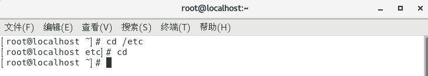
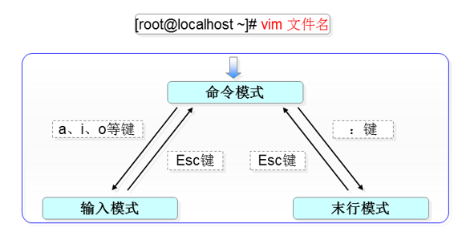
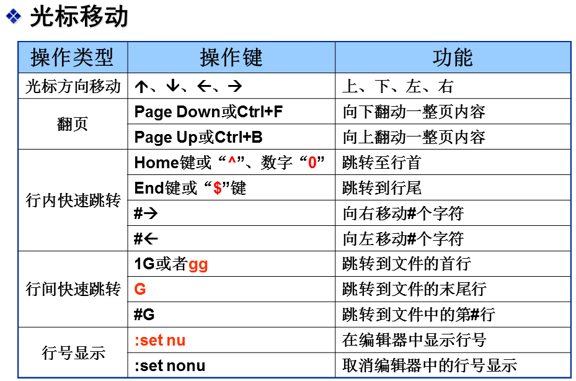
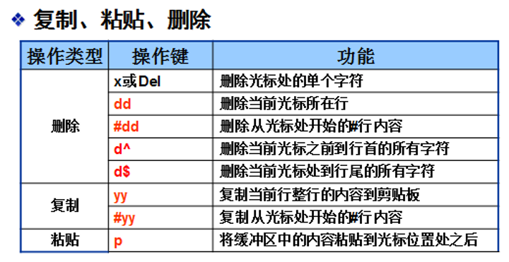
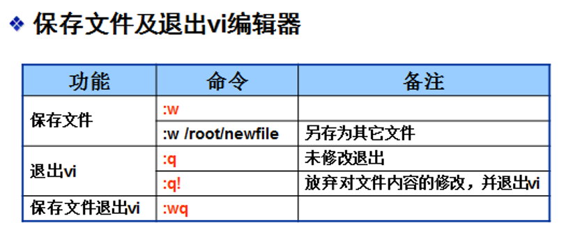
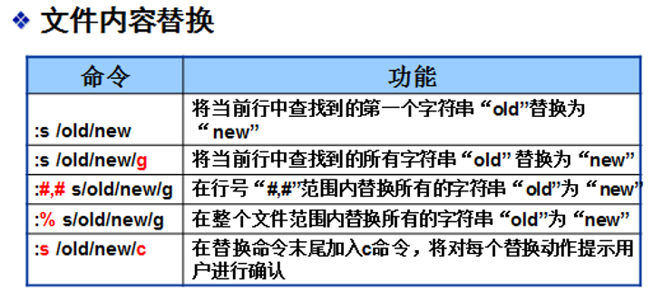

# 根目录和家目录
在Linux系统中永远只有一个根目录“/”，Linux系统中的目录结构是固定的，跟磁盘分区没有任何关系。

Linux系统中所有用户的家目录都是集中存放在“/home”目录中，以用户名命名：
用户“jerry”的家目录是“/home/jerry”
用户“natasha”的家目录是“/home/natasha”

root用户是个例外，他的家目录是单独的“/root”。

# 绝对路径和相对路径

cd命令用于切换工作目录
如果只是单纯执行cd命令，默认将返回到用户的家目录。



绝对路径：以根目录“/”作为起点，如“/boot/grub”。使用绝对路径可以准确地表示一个目录（或文件）所在的位置。
相对路径：以当前的工作目录作为起点，在开头不使用“/”符号，如“grub.conf”，表示当前目录下的grub.conf文件，而“/grub.conf”则表示根目录下的grub.conf文件。

如果当前目录是“/root”，要进入当前目录下的一个名为test的子目录中，可以使用相对路径“cd test”，也可以使用绝对路径“cd /root/test”。
对于初学者，建议尽量使用绝对路径，以便于理解和区分。
```bash
cd test         #相对路径
cd /root/test   #绝对路径
```
“.”表示当前目录，例如“./grub.conf”表示当前目录下的gurb.conf文件。
“..”表示以当前目录的上一级目录（父目录），例如若当前处于“/boot/grub”目录中，则“../vmlinuz”等同于“/boot/vmlinuz”。

# 文件管理命令

## Linux命令
用于实现某一类功能的指令或程序   
命令的执行依赖于解释器程序（例如：/bin/bash）

## Linux命令的分类
内部命令：指集成在Shell里的命令，属于shell的一部分，系统中没有与命令单独对应的程序文件。 

外部命令：独立于shell之外的命令，每个外部命令都对应了系统中的一个文件，Linux系统必须要知道外部命令对应的程序文件所在的位置，才能由shell加载并执行这些命令。  

可以用type命令来判断一个命令是内部命令还是外部命令

外部命令的程序文件大都存放在/bin、/sbin、/usr/bin……这些目录里，Linux系统默认将这些路径添加到一个名为PATH的变量里，执行“echo $PATH”命令可以显示出PATH变量里的保存的目录路径（路径之间用“：”间隔）。

如果把一个外部命令所对应的程序文件删了，或者是存放外部命令程序文件的目录没有添加到PATH变量里，这些都会导致外部命令无法正常执行

## Linux命令的通用命令格式
命令字  [选项]  [参数]

## 选项及参数的含义
选项：用于调节命令的具体功能  
* 以 “-”引导短格式选项（单个字符），例如“-l”  
* 以“--”引导长格式选项（多个字符），例如“--color”      
* 多个短格式选项可以写在一起，只用一个“-”引导，例如“ls –l –a”命令与“ls –al”命令功能完全相同。

## 命令行编辑的几个辅助操作
* Tab键：自动补齐
* 反斜杠“\”：强制换行
* 快捷键 Ctrl+U：清空至行首
* 快捷键 Ctrl+K：清空至行尾
* 快捷键 Ctrl+L：清屏
* 快捷键 Ctrl+C：取消本次命令编辑

**内部命令help**  
* 查看Bash内部命令的帮助信息  

**命令的“--help” 选项**    
* 适用于大多数外部命令   

**使用man命令阅读手册页**
* 使用“&uarr;”、“&darr;”方向键滚动文本
* 使用Page Up和Page Down键翻页 
* 按Q或q键退出阅读环境、按“/”键后查找内容

**使用info命令阅读信息页**

## 目录操作命令
* pwd
* cd
* ls
* mkdir
* du

### pwd

pwd命令用于显示用户当前所在的工作目录位置，使用pwd命令可以不加任何选项或参数。

“/root”的含义：
* “/”，是Linux系统的根目录，也是其它所有目录的起点。
* “/root”，是根目录下面的一个子目录，它是管理员root用户的家目录。


```bash
pwd		#显示当前工作目录的绝对路径
pwd -P          #正确显示实际路径，而不是连接文件的路径。如/var/mail是连接文件
```
### cd
```bash
cd [相对路径或绝对路径]   #切换工作目录
cd ~reol                #去到reol这个用户的家目录
cd ~                    #回到自己的家目录
cd                      #没加上任何路径，默认回到家目录
cd ..                   #表示去到上层目录
cd -                    #回到前一个目录
```
### ls
ls显示结果以不同的颜色来区分文件类别。
* 蓝色代表目录
* 灰色代表普通文件
* 绿色代表可执行文件
* 红色代表压缩文件
* 浅蓝色代表链接文件

* -”代表普通文件
* “d”代表目录
* “l”代表符号链接
* “c”代表字符设备
* “b”代表块设备

“？”可以匹配文件名中的一个任意字符，  
“*”可以匹配文件名中的任意多个字符。

显示/etc目录下文件名以ns开头，扩展名是conf的文件的详细信息  

    ls –l /etc/ns*.conf

显示/etc目录下文件名以v开头，文件名一共是4个字符的文件的详细信息 

    Ls –l /etc/v???

```bash
ls [选项] [目录或是文件]	    #显示当前目录下的目录和文件
ls -a                       #显示所有文件及目录 (. 开头的隐藏文件也会列出)
ls -A                       #列出除.及..的其它文件
ls -l                       #除文件名称外，亦将文件型态、权限、拥有者、文件大小等资讯详细列出
ls -h                       #以易读大小显示        
ls -r                       #将文件以相反次序显示(原定依英文字母次序)
ls -R                       #若目录下有文件，则以下之文件亦皆依序列出
ls -t                       #将文件依建立时间之先后次序列出
ls -S                       #以文件大小排序
ls -F                       #在列出的文件名称后加一符号；例如可执行档则加 "*", 目录则加 "/"  
#列出根目录(\)下的所有目录：
ls /
#列出目前工作目录下所有名称是 s 开头的文件，越新的排越后面:
ls -ltr s*  
#将 /bin 目录以下所有目录及文件详细资料列出 :
ls -lR /bin
#列出目前工作目录下所有文件及目录；目录于名称后加 "/", 可执行档于名称后加 "*" :
ls -AF
```
### mkdir
```bash
mkdir [选项] 要创建的目录   #用于创建目录
mkdir -m 711 test          #可配置文件的权限
mkdir -p test/test1        #确保目录名称存在，不存在的就建一个。
#在工作目录下的 runoob2 目录中，建立一个名为 test 的子目录。若 runoob2 目录原本不存在，则建立一个。（注：本例若不加 -p 参数，且原本 runoob2 目录不存在，则产生错误。）
mkdir -p runoob2/test
```
### du
```bash
du [选项] [目录或是文件]    #显示目录或文件的大小
du -a 或 du -all           #显示目录中个别文件的大小。
du -b 或 du -bytes         #显示目录或文件大小时，以byte为单位。
du -c 或 du --total        #除了显示个别目录或文件的大小外，同时也显示所有目录或文件的总和。
du -D 或 du --dereference-args      #显示指定符号连接的源文件大小。
du -h 或 du --human-readable        #以K，M，G为单位，提高信息的可读性。
du -H 或du --si                     #与-h参数相同，但是K，M，G是以1000为换算单位。
du -k 或 du --kilobytes             #以1024 bytes为单位。
du -l 或 du --count-links           #重复计算硬件连接的文件。
du -L<符号连接> 或 du --dereference<符号连接>       #显示选项中所指定符号连接的源文件大小。
du -m 或 du --megabytes         #以1MB为单位。
du -s 或 du --summarize         #仅显示总计。
du -S 或 du --separate-dirs     #显示个别目录的大小时，并不含其子目录的大小。
du -x 或 du --one-file-xystem   #以一开始处理时的文件系统为准，若遇上其它不同的文件系统目录则略过。
du -X<文件> 或 du --exclude-from=<文件>     #在<文件>指定目录或文件。
du --exclude=<目录或文件>                   #略过指定的目录或文件。
du --max-depth=<目录层数>                   #超过指定层数的目录后，予以忽略。
```
## 文件操作命令
* touch
* file
* cp
* rm
* mv
* which
* find
* ln


### touch
```bash
touch 文件名称          #创建一个空文件
```
### file
```bash
file [选项] [目录或是文件]      #辨识文件类型。
file -b 　              #列出辨识结果时，不显示文件名称。
file -c 　              #详细显示指令执行过程，便于排错或分析程序执行的情形。
file -f<名称文件> 　     #指定名称文件，其内容有一个或多个文件名称时，让file依序辨识这些文件，格式为每列一个文件名称。
file -L 　                  #直接显示符号连接所指向的文件的类别。
file -m<魔法数字文件> 　     #指定魔法数字文件。
file -z 　                  #尝试去解读压缩文件的内容。
```
### cp

cp [选项] 源文件或目录 目标文件或目录  
在用cp命令复制的同时还可以将文件改名。

```bash
cp [选项] [目录或是文件]            #复制文件或目录。
cp -a           #此选项通常在复制目录时使用，它保留链接、文件属性，并复制目录下的所有内容。其作用等于dpR参数组合。
cp -d           #复制时保留链接。这里所说的链接相当于 Windows 系统中的快捷方式。
cp -f          #覆盖已经存在的目标文件而不给出提示。
cp -i          #与 -f 选项相反，在覆盖目标文件之前给出提示，要求用户确认是否覆盖，回答 y 时目标文件将被覆盖。
cp -p          #除复制文件的内容外，还把修改时间和访问权限也复制到新文件中。
cp -r          #若给出的源文件是一个目录文件，此时将复制该目录下所有的子目录和文件。
cp -l          #不复制文件，只是生成链接文件。
#使用指令 cp 将当前目录 test/ 下的所有文件复制到新目录 newtest 下，输入如下命令：
cp –r test/ newtest 
```
### rm
```bash
rm [选项] [目录或是文件]            #删除一个文件或者目录
rm -i          #删除前逐一询问确认。
rm -f          #即使原档案属性设为唯读，亦直接删除，无需逐一确认。
rm -r          #将目录及以下之档案亦逐一删除。
#删除当前目录下的所有文件及目录，命令行为：
rm  -r  * 
```
### mv

mv命令相当于Windows中的“剪切”操作，Linux中的“重命名”操作也是由mv命令完成的。

```bash
mv [选项] [目录或是文件]            #为文件或目录改名、或将文件或目录移入其它位置
mv -b           #当目标文件或目录存在时，在执行覆盖前，会为其创建一个备份。
mv -i           #如果指定移动的源目录或文件与目标的目录或文件同名，则会先询问是否覆盖旧文件，输入 y 表示直接覆盖，输入 n 表示取消该操作。
mv -f           #如果指定移动的源目录或文件与目标的目录或文件同名，不会询问，直接覆盖旧文件。
mv -n           #不要覆盖任何已存在的文件或目录。
mv -u           #当源文件比目标文件新或者目标文件不存在时，才执行移动操作。
#将文件 aaa 改名为 bbb :
mv aaa bbb
#将 info 目录放入 logs 目录中。注意，如果 logs 目录不存在，则该命令将 info 改名为 logs
mv info/ logs 
#将 /usr/runoob 下的所有文件和目录移到当前目录下
mv /usr/runoob/*  . 
```
### which

查找外部命令所对应的程序文件

which命令用于查找Linux外部命令所对应的程序文件，其搜索范围由环境变量PATH决定。

```bash
which [选项] 外部命令       #用于查找文件
which -n<文件名长度> 　     #指定文件名长度，指定的长度必须大于或等于所有文件中最长的文件名。
which -p<文件名长度> 　     #与-n参数相同，但此处的<文件名长度>包括了文件的路径。
which -w 　                #指定输出时栏位的宽度。
```
### find

find path -option [-print] [ -exec -ok command] {} \\;  

用来在指定目录下查找文件。任何位于参数之前的字符串都将被视为欲查找的目录名。如果使用该命令时，不设置任何参数，则 find 命令将在当前目录下查找子目录与文件。并且将查找到的子目录和文件全部进行显示。 
expression 中可使用的选项有二三十个之多，在此只介绍最常用的部份。  

-mount, -xdev : 只检查和指定目录在同一个文件系统下的文件，避免列出其它文件系统中的文件  
-amin n : 在过去 n 分钟内被读取过  
-anewer file : 比文件 file 更晚被读取过的文件  
-atime n : 在过去n天内被读取过的文件    
-cmin n : 在过去 n 分钟内被修改过     
-cnewer file :比文件 file 更新的文件    
-ctime n : 在过去n天内被修改过的文件     

-empty : 空的文件-gid n or -group name : gid 是 n 或是 group 名称是 name     
-ipath p, -path p : 路径名称符合 p 的文件，ipath 会忽略大小写    
-name name, -iname name : 文件名称符合 name 的文件。iname 会忽略大小写     
-size n : 文件大小 是 n 单位，b 代表 512 位元组的区块，c 表示字元数，k 表示 kilo bytes，w 是二个位元组。    

-type c : 文件类型是 c 的文件。    
d: 目录   
c: 字型装置文件    
b: 区块装置文件    
p: 具名贮列    
f: 一般文件    
l: 符号连结    
s: socket      
-pid n : process id 是 n 的文件    
```bash
#将当前目录及其子目录下所有文件后缀为 .c 的文件列出来:
find . -name "*.c"
#将当前目录及其子目录中的所有文件列出：
find . -type f
#将当前目录及其子目录下所有最近 20 天内更新过的文件列出:
find . -ctime  20
#查找 /var/log 目录中更改时间在 7 日以前的普通文件，并在删除之前询问它们：
find /var/log -type f -mtime +7 -ok rm {} \;
#查找当前目录中文件属主具有读、写权限，并且文件所属组的用户和其他用户具有读权限的文件：
find . -type f -perm 644 -exec ls -l {} \;
#查找系统中所有文件长度为 0 的普通文件，并列出它们的完整路径：
find / -type f -size 0 -exec ls -l {} \;
```
### ln
Linux文件系统中，有所谓的链接(link)，我们可以将其视为档案的别名，而链接又可分为两种 : 硬链接(hard link)与软链接(symbolic link)，硬链接的意思是一个档案可以有多个名称，而软链接的方式则是产生一个特殊的档案，该档案的内容是指向另一个档案的位置。硬链接是存在同一个文件系统中，而软链接却可以跨越不同的文件系统。 

不论是硬链接或软链接都不会将原本的档案复制一份，只会占用非常少量的磁碟空间。

**软链接：**
* 软链接，以路径的形式存在。类似于Windows操作系统中的快捷方式
* 软链接可以 跨文件系统 ，硬链接不可以
* 软链接可以对一个不存在的文件名进行链接
* 软链接可以对目录进行链接

**硬链接：**
* 硬链接，以文件副本的形式存在。但不占用实际空间。
* 不允许给目录创建硬链接
* 硬链接只有在同一个文件系统中才能创建
```bash
ln [参数][源文件或目录][目标文件或目录]         #为某一个文件在另外一个位置建立一个同步的链接
ln -b          #删除，覆盖以前建立的链接
ln -d          #允许超级用户制作目录的硬链接
ln -f          #强制执行
ln -i          #交互模式，文件存在则提示用户是否覆盖
ln -n          #把符号链接视为一般目录
ln -s          #软链接(符号链接)
ln -v          #显示详细的处理过程
#给文件创建软链接，为log2013.log文件创建软链接link2013，如果log2013.log丢失，link2013将失效：
ln -s log2013.log link2013
#输出
[root@localhost test]# ll
-rw-r--r-- 1 root bin      61 11-13 06:03 log2013.log
[root@localhost test]# ln -s log2013.log link2013
[root@localhost test]# ll
lrwxrwxrwx 1 root root     11 12-07 16:01 link2013 -> log2013.log
-rw-r--r-- 1 root bin      61 11-13 06:03 log2013.log
#给文件创建硬链接，为log2013.log创建硬链接ln2013，log2013.log与ln2013的各项属性相同
ln log2013.log ln2013
#输出
[root@localhost test]# ll
lrwxrwxrwx 1 root root     11 12-07 16:01 link2013 -> log2013.log
-rw-r--r-- 1 root bin      61 11-13 06:03 log2013.log
[root@localhost test]# ln log2013.log ln2013
[root@localhost test]# ll
lrwxrwxrwx 1 root root     11 12-07 16:01 link2013 -> log2013.log
-rw-r--r-- 2 root bin      61 11-13 06:03 ln2013
-rw-r--r-- 2 root bin      61 11-13 06:03 log2013.log
```

## 文件内容操作命令
* cat
* more
* less
* head
* tail
* wc
* grep

### cat

cat是应用最为广泛的文件内容查看命令。

cat在显示文本文件的内容时不进行停顿，因此不适合查看长文件。

```bash
cat [选项] 文件         #用于连接文件并打印到标准输出设备上
cat -n 或 cat --number          #由 1 开始对所有输出的行数编号。
cat -b 或 cat --number-nonblank #和 -n 相似，只不过对于空白行不编号。
cat -s 或 cat --squeeze-blank   #当遇到有连续两行以上的空白行，就代换为一行的空白行。
cat -v 或 cat --show-nonprinting    #使用 ^ 和 M- 符号，除了 LFD 和 TAB 之外。
cat -E 或 cat --show-ends           #在每行结束处显示 $。
cat -T 或 cat --show-tabs           #将 TAB 字符显示为 ^I。
cat -A, cat --show-all              #等价于 -vET。
cat -e          #等价于"-vE"选项；
cat -t          #等价于"-vT"选项；
#把 textfile1 的文档内容加上行号后输入 textfile2 这个文档里：
cat -n textfile1 > textfile2
#把 textfile1 和 textfile2 的文档内容加上行号（空白行不加）之后将内容附加到 textfile3 文档里：
cat -b textfile1 textfile2 >> textfile3
#清空 /etc/test.txt 文档内容：
cat /dev/null > /etc/test.txt
#cat 也可以用来制作镜像文件。例如要制作软盘的镜像文件，将软盘放好后输入：
cat /dev/fd0 > OUTFILE
#相反的，如果想把 image file 写到软盘，输入：
cat IMG_FILE > /dev/fd0
```
### more
more 命令类似 cat ，不过会以一页一页的形式显示，更方便使用者逐页阅读，而最基本的指令就是按空白键（space）就往下一页显示，按 b 键就会往回（back）一页显示，而且还有搜寻字串的功能（与 vi 相似），使用中的说明文件，请按 h 。
```bash
more [参数] 文件     #查看文件内容
more -num           #一次显示的行数
more -d             #提示使用者，在画面下方显示 [Press space to continue, 'q' to quit.] ，如果使用者按错键，则会显示 [Press 'h' for instructions.] 而不是 '哔' 声
more -l             #取消遇见特殊字元 ^L（送纸字元）时会暂停的功能
more -f             #计算行数时，以实际上的行数，而非自动换行过后的行数（有些单行字数太长的会被扩展为两行或两行以上）
more -p             #不以卷动的方式显示每一页，而是先清除萤幕后再显示内容
more -c             #跟 -p 相似，不同的是先显示内容再清除其他旧资料
more -s             #当遇到有连续两行以上的空白行，就代换为一行的空白行
more -u             #不显示下引号 （根据环境变数 TERM 指定的 terminal 而有所不同）
more +/pattern      #在每个文档显示前搜寻该字串（pattern），然后从该字串之后开始显示
more +num           #从第 num 行开始显示
#逐页显示 testfile 文档内容，如有连续两行以上空白行则以一行空白行显示。
more -s testfile
#从第 20 行开始显示 testfile 之文档内容。
more +20 testfile
# Enter 向下n行，需要定义。默认为1行
# Ctrl+F 向下滚动一屏
# 空格键 向下滚动一屏
# Ctrl+B 返回上一屏
# = 输出当前行的行号
# ：f 输出文件名和当前行的行号
# V 调用vi编辑器
# !命令 调用Shell，并执行命令
# q 退出more
```
### less
```bash
less [参数] 文件            #可以随意浏览文件，支持翻页和搜索，支持向上翻页和向下翻页。
less -b <缓冲区大小>        #设置缓冲区的大小
less -e                     #当文件显示结束后，自动离开
less -f                     #强迫打开特殊文件，例如外围设备代号、目录和二进制文件
less -g                     #只标志最后搜索的关键词
less -i                     #忽略搜索时的大小写
less -m                     #显示类似more命令的百分比
less -N                     #显示每行的行号
less -o <文件名>            #将less 输出的内容在指定文件中保存起来
less -Q                     #不使用警告音
less -s                     #显示连续空行为一行
less -S                     #行过长时间将超出部分舍弃
less -x <数字>              #将"tab"键显示为规定的数字空格
# /字符串：向下搜索"字符串"的功能
# ?字符串：向上搜索"字符串"的功能
# n：重复前一个搜索（与 / 或 ? 有关）
# N：反向重复前一个搜索（与 / 或 ? 有关）
# b 向上翻一页
# d 向后翻半页
# h 显示帮助界面
# Q 退出less 命令
# u 向前滚动半页
# y 向前滚动一行
# 空格键 滚动一页
# 回车键 滚动一行
# [pagedown]： 向下翻动一页
# [pageup]： 向上翻动一页

#查看文件
less log2013.log
#ps查看进程信息并通过less分页显示
ps -ef |less
#查看命令历史使用记录并通过less分页显示
[root@localhost test]# history | less
#浏览多个文件
less log2013.log log2014.log
```
### head
```bash
head [参数] [文件]          #用于查看文件的开头部分的内容，有一个常用的参数 -n 用于显示行数，默认为 10，即显示 10 行的内容。
head -q                     #隐藏文件名
head -v                     #显示文件名
head -c<数目>               #显示的字节数。
head -n<行数>               #显示的行数。
#要显示 runoob_notes.log 文件的开头 10 行，请输入以下命令：
head runoob_notes.log
#显示 notes.log 文件的开头 5 行，请输入以下命令：
head -n 5 runoob_notes.log
#显示文件前 20 个字节:
head -c 20 runoob_notes.log
```
### tail
```bash
tail [参数] [文件]          #用于查看文件的内容，有一个常用的参数 -f 常用于查阅正在改变的日志文件。
tail -f                 #循环读取
tail -q                 #不显示处理信息
tail -v                 #显示详细的处理信息
tail -c<数目>           #显示的字节数
tail -n<行数>           #显示文件的尾部 n 行内容
#要显示 notes.log 文件的最后 10 行，请输入以下命令：
tail notes.log         # 默认显示最后 10 行
#要跟踪名为 notes.log 的文件的增长情况，请输入以下命令：
tail -f notes.log      #此命令显示 notes.log 文件的最后 10 行。当将某些行添加至 notes.log 文件时，tail 命令会继续显示这些行。 显示一直继续，直到您按下（Ctrl-C）组合键停止显示。
#显示文件 notes.log 的内容，从第 20 行至文件末尾:
tail -n +20 notes.log
#显示文件 notes.log 的最后 10 个字符:
tail -c 10 notes.log
```
### wc
```bash
wc 文件         #命令用于计算字数
wc -c 或 wc --bytes 或 wc --chars   #只显示Bytes数。
wc -l 或 wc --lines                 #显示行数。
wc -w 或 wc --words                 #只显示字数。
#在默认的情况下，wc将计算指定文件的行数、字数，以及字节数。使用的命令为：
wc testfile 
#先查看testfile文件的内容，可以看到：
$ cat testfile  

Linux networks are becoming more and more common, but scurity is often an overlooked  
issue. Unfortunately, in today’s environment all networks are potential hacker targets,  
fro0m tp-secret military research networks to small home LANs.  
Linux Network Securty focuses on securing Linux in a networked environment, where the  
security of the entire network needs to be considered rather than just isolated machines.  
It uses a mix of theory and practicl techniques to teach administrators how to install and  
use security applications, as well as how the applcations work and why they are necesary. 
#使用 wc统计，结果如下：
$ wc testfile           # testfile文件的统计信息  
3 92 598 testfile       # testfile文件的行数为3、单词数92、字节数598 
#如果想同时统计多个文件的信息，例如同时统计testfile、testfile_1、testfile_2，可使用如下命令：
$ wc testfile testfile_1 testfile_2  #统计三个文件的信息  
3 92 598 testfile                    #第一个文件行数为3、单词数92、字节数598  
9 18 78 testfile_1                   #第二个文件的行数为9、单词数18、字节数78  
3 6 32 testfile_2                    #第三个文件的行数为3、单词数6、字节数32  
15 116 708 总用量                    #三个文件总共的行数为15、单词数116、字节数708 
```
### grep

find和grep命令的区别：  
find命令是在某个指定的路径下找我们需要的文件或目录，目标是文件或目录。  
grep命令是在某个文件中找我们所需要的某部分内容，目标是字符串。  
find命令类似于在Windows系统中执行的“搜索”操作，而grep命令则类似于在WORD中执行的“查找”操作。

```bash
grep [选项] 查找内容 源文件         #用于查找文件里符合条件的字符串
grep -n		                    #显示匹配行及行号
grep -i		                    #忽略字母大小写
grep -r                         #递归查找
grep -v                         #显示不包含匹配文本的所有行。
#请在hello.txt文件中，查找 "yes" 所在行，并且显示行号
cat hello.txt | grep -ni yes
#cat hello.txt  将hello.txt的内容浏览出来
# | 是将cat浏览出来的内容交给后面的命令处理
#grep yes  是将 | 交过来的内容进行过滤查找

#在当前目录中，查找后缀有 file 字样的文件中包含 test 字符串的文件，并打印出该字符串的行
grep test *file 
#查找指定目录/etc/acpi 及其子目录（如果存在子目录的话）下所有文件中包含字符串"update"的文件，并打印出该字符串所在行的内容，使用的命令为：
grep -r update /etc/acpi 
#查找文件名中包含 test 的文件中不包含test 的行
grep -v test *test*
```
## 归档及压缩命令
* gzip
* bzip2
* tar


### gzip
gzip 是 Linux 系统中经常用来对文件进行压缩和解压缩的命令，通过此命令压缩得到的新文件，其扩展名通常标记为“.gz”。

gzip 命令只能用来压缩文件，不能压缩目录，即便指定了目录，也只能压缩目录内的所有文件。
```bash
gzip [选项] 源文件
gzip -c	            #将压缩数据输出到标准输出中，并保留源文件。
gzip -d	            #对压缩文件进行解压缩。
gzip -r	            #递归压缩指定目录下以及子目录下的所有文件。
gzip -v	            #对于每个压缩和解压缩的文件，显示相应的文件名和压缩比。
gzip -l	            #对每一个压缩文件，显示以下字段：压缩文件的大小；未压缩文件的大小；压缩比；未压缩文件的名称。
gzip -数字	        #用于指定压缩等级，-1 压缩等级最低，压缩比最差；-9 压缩比最高。默认压缩比是 -6。

[root@localhost ~]# gzip install.log
#压缩instal.log 文件
[root@localhost ~]# ls
anaconda-ks.cfg install.log.gz install.log.syslog
#压缩文件生成，但是源文件也消失了

[root@localhost ~]# gzip -c anaconda-ks.cfg >anaconda-ks.cfg.gz
#使用-c选项，但是不让压缩数据输出到屏幕上，而是重定向到压缩文件中，这样可以缩文件的同时不删除源文件
[root@localhost ~]# ls
anaconda-ks.cfg anaconda-ks.cfg.gz install.log.gz install.log.syslog
#可以看到压缩文件和源文件都存在

[root@localhost ~]# mkdir test
[root@localhost ~]# touch test/test1
[root@localhost ~]# touch test/test2
[root@localhost ~]# touch test/test3 #建立测试目录，并在里面建立几个测试文件
[root@localhost ~]# gzip -r test/
#压缩目录，并没有报错
[root@localhost ~]# ls
anaconda-ks.cfg anaconda-ks.cfg.gz install.log.gz install.log.syslog test
#但是查看发现test目录依然存在，并没有变为压缩文件
[root@localhost ~]# ls test/
testl .gz test2.gz test3.gz
#原来gzip命令不会打包目录，而是把目录下所有的子文件分别压缩
```
### bzip2

bzip2采用新的压缩演算法，压缩效果比传统的LZ77/LZ78压缩演算法来得好。

bzip2 用于压缩文件，文件经压缩后以 .bz2 的扩展名结尾。bzip2 只能针对一个文件进行压缩，当要压缩多个文件时，需要将文件 tar 归档 。

bunzip2 命令用来解压 bz2 文件，事实上 bunzip2 就是 bzip2 的硬连接（ bzip2 –d 等价于 bunzip2 ），命令选项基本相同。

**命令格式：**
```bash
bzip2 [ -cdfkqstvzVL123456789 ] [ filenames ...  ]
bzip2 [ -h|--help ]
bunzip2 [ -fkvsVL ] [ filenames ...  ]
bunzip2 [ -h|--help ]
```
**常用选项**
```bash
-c --stdout
    #将压缩或解压的数据传至标准输出

-d --decompress
    #解压压缩包

-z --compress
    #-d 选项的补充（强制执行压缩）

-t --test
    #检验压缩包

-f --force
    #压缩或解压时，强制覆盖同名文件（默认不覆盖已存在的文件）

-k --keep
    #在压缩或解压缩时保留源文件（不删除 .bz2 文件）

-q --quiet
    #只显示重要的警告信息

-v --verbose
    #显示详细的执行过程
```

**使用实例：**
```bash
# 压缩文件，默认会删除源文件
[Linux]$ bzip2 test.tar
[Linux]$ ls
test.tar.bz2

# 压缩文件并保留源文件
[Linux]$ bzip2 -k test.tar
[Linux]$ ls
test.tar  test.tar.bz2

# 解压压缩包，解压后的文件是 tar 归档文件
[Linux]$ bzip2 -d test.tar.bz2

# 直接解压出压缩包内的文件
[Linux]$ tar -jxvf test.tar.bz2

# 压缩多个文件
[Linux]$ tar -jcvf text.tar.bz2 /etc/ /opt/
```

### tar

将许多文件一起保存至一个单独的磁带或磁盘归档，并能从归档中单独还原所需文件。

**补充**  

tar命令 可以为linux的文件和目录创建档案。利用tar，可以为某一特定文件创建档案（备份文件），也可以在档案中改变文件，或者向档案中加入新的文件。tar最初被用来在磁带上创建档案，现在，用户可以在任何设备上创建档案。利用tar命令，可以把一大堆的文件和目录全部打包成一个文件，这对于备份文件或将几个文件组合成为一个文件以便于网络传输是非常有用的。

首先要弄清两个概念：打包和压缩。打包是指将一大堆文件或目录变成一个总的文件；压缩则是将一个大的文件通过一些压缩算法变成一个小文件。

为什么要区分这两个概念呢？这源于Linux中很多压缩程序只能针对一个文件进行压缩，这样当你想要压缩一大堆文件时，你得先将这一大堆文件先打成一个包（tar命令），然后再用压缩程序进行压缩（gzip bzip2命令）。

**常用选项**
```bash
-c: 
    #建立压缩档案
-x：
    #解压
-t：
    #查看内容
-r：
    #向压缩归档文件末尾追加文件
-u：
    #更新原压缩包中的文件

#这五个是独立的命令，压缩解压都要用到其中一个，可以和别的命令连用但只能用其中一个。下面的参数是根据需要在压缩或解压档案时可选的。

-z：#有gzip属性的
-j：#有bz2属性的
-Z：#有compress属性的
-v：#显示所有过程
-O：#将文件解开到标准输出
```

**示例**
```bash
tar -cf all.tar *.jpg
#这条命令是将所有.jpg的文件打成一个名为all.tar的包。-c是表示产生新的包，-f指定包的文件名。

tar -rf all.tar *.gif
#这条命令是将所有.gif的文件增加到all.tar的包里面去。-r是表示增加文件的意思。

tar -uf all.tar logo.gif
#这条命令是更新原来tar包all.tar中logo.gif文件，-u是表示更新文件的意思。

tar -tf all.tar
#这条命令是列出all.tar包中所有文件，-t是列出文件的意思

tar -xf all.tar
#这条命令是解出all.tar包中所有文件，-t是解开的意思
```

## alias命令——设置命令别名

命令别名通常是命令的缩写，对于经常使用的命令，通过设置别名可以简化操作。  
alias命令的一般格式：  
alias [别名=‘标准Shell命令行’]  

单独执行alias命令可以列出当前系统中已经存在的别名命令。

```bash
alias cpd='cat /etc/passwd'         #设置cat /etc/passwd的别名为cpd

#如果要取消所设置的别名命令，可以使用unalias命令。
unalias cpd
```

## 输入输出重定向

Linux系统中标准的输入设备为键盘，标准输出设备为屏幕，但在某些情况下，我们希望能从键盘以外的其他输入设备读取数据，或者将数据送到屏幕外的其他输出设备，这种情况称为重定向。

输入重定向：<
输出重定向：>或>>  
* >  会覆盖原来的文件
* >> 是在文件末尾另起一行写入
重定向的目标通常是一个文件。

**输出重定向**
```bash
cat /etc/passwd > pass.txt
#查看/etc/passwd文件的内容，并将输出结果保存到pass.txt文件中。

tail -3 /etc/shadow >> pass.txt
#查看/etc/shadow文件的后3行内容，并将输出结果追加保存到pass.txt文件中。
```
## 管道符“|”

通过管道符“|”，可以把多个简单的命令连接起来实现更加复杂的功能。  
管道符用于将“|”左边命令的执行结果作为“|”右边命令的输入。
```bash
ls -lh /etc | more
#分页显示/etc目录下所有文件和子目录的详细信息。

ls -lh /etc | grep net
#显示/etc目录下包含有“net”关键字的所有文件和子目录的详细信息。

ls -l /etc/*.conf | wc –l 
#统计/etc目录下所有以“.conf”结尾的文件的个数。

grep -v "^#" /etc/httpd/conf/httpd.conf | gerp –v “^$”
#查看/etc/httpd/conf/httpd.conf文件中除了以“#”开头的行和空行以外的内容。
#^表示行首,$表示行尾,^$表示空行
```

# vi编辑器的使用

vi编辑器相当于Windows系统中的WORD加记事本。


命令格式：
vim [文件名]

如果指定的文件不存在，vim会创建文件并进入编辑状态，如果文件存在，则进入编辑状态对其进行编辑。

命令模式。启动vi编辑器后默认进入命令模式，主要完成光标移动、字符串查找、删除、复制、粘贴等操作。不论用户当前处于何种模式，只要按下Esc键，即可进入命令模式。

插入模式。在命令模式下，按“i”、“o”、“a”键或“Insert”键就可以切换到插入模式，该模式中的主要操作是录入文件内容，可以对文件正文进行修改、或者添加新的内容。处于插入模式时，vi编辑器的最后一行会出现“—INSERT—”的状态提示信息。

末行模式。在命令模式下，按“:”键即可进入末行模式，该模式中可以保存文件、退出编辑器，以及对文件内容进行查找、替换等操作。处于末行模式时，vi编辑器的最后一行会出现“:”提示符。



## 命令模式下的基本操作



### 复制、粘贴、删除



### 文件内容查找


### 撤销编辑


## 末行模式下的基本操作



### 文件内容替换

:[替换范围] s/旧的内容/新的内容[/g][/c]

