*摆烂好久了，距离上一次写博客已经过去了好几个月，上半年在家上网课，本来想着能把Linux课程的笔记做完，做了三章就不想做了。期末了，开始预习概率统计，写了一点，发现光是过一遍都来不及，还做笔记，所以又黄了。今年大三了，感觉浑浑噩噩的，不能再摆烂了。最近在学vue，知识点过了一遍，在做大创的时候发现不能成体系的开发，就在B站找了个项目跟着做做:[【黑马程序员】前端开发之Vue项目实战_Element-UI【配套源码+笔记】](https://www.bilibili.com/video/av757479198?p=1&vd_source=0df7a4af52b622cdb9db5fb5ef7d004b)。我觉得光是跟着把代码敲一遍印象不深，然后这个时候就想起了这个被我荒废了好久了博客，是时候拿出来更新了！源码我也上传了，github同步更新，gitee更新会隔几天，没别的原因，只是懒而已*  

**github：**[vue_shop](https://github.com/Reol077/vue_shop)
**gitee：**[vue_shop](https://gitee.com/freereol/vue_shop)  

*下面开始正题*

# 项目初始化

## 配置后台接口  

### 导入数据库

*这里有个插曲，就是太久没用了，我数据库密码忘了！！本来我天真的以为把MySQL卸了重装一下就好了，事实证明我太天真了，然后就全网搜索怎么重置，妈的我可太难了。
对了，一开始用的是xampp集成的mysql，怎么搞怎么不行，后来直接卸了他直装的MySQL，一下子搞定的，就是说我浪费了一整个下午。麻了*  

打开Navicat或者别的啥新建一个数据库mydb，运行sql脚本
sql脚本在vue_api_server文件夹下的db文件夹里
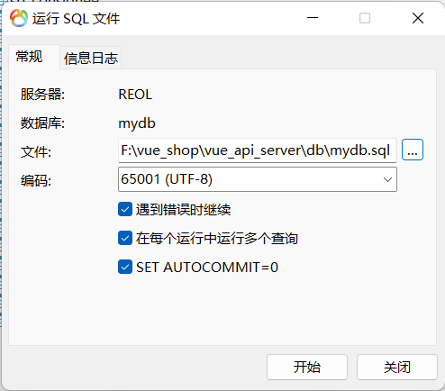

### 终端打开vue_api_server文件夹执行命令

```
node .\app.js
```

如果提示缺啥包，装一下就好了
运行没问题是这样的
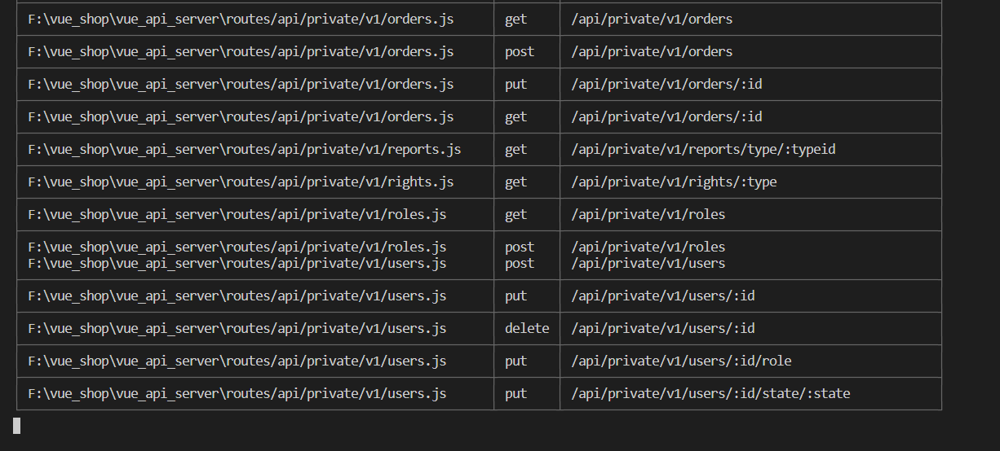
然后用apifox或者别的啥测试接口的软件根据接口文档测试一下接口能不能用，接口文档也在vue_api_server这个文件夹里

## 初始化vue

使用vue提供的ui界面

```
vue ui
```

然后新建页面
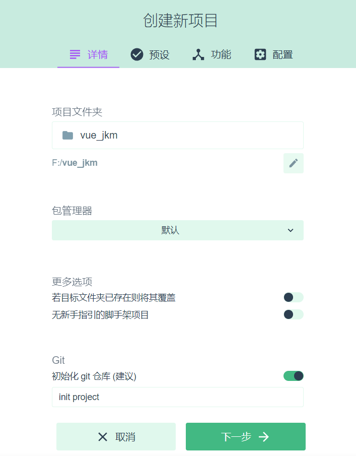
然后配置一下项目，就是选一下要装的插件。我没装eslint，那个代码检查太麻烦了，等我什么时候出了vue的新手村再说吧。
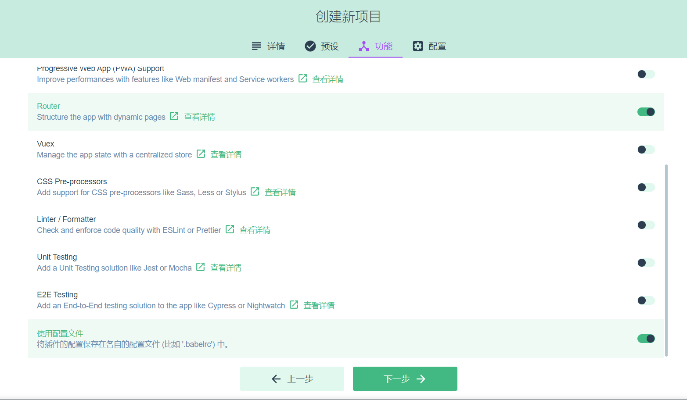
由于vue3我还没学，就先用vue2
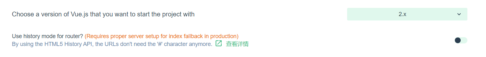
然后点创建项目就好了，其实完全可以一条命令执行，但是我比较菜，有些插件的应用配置就得半天，ui界面卡是卡了点，但是挺傻瓜的，诶嘿~

## 装一下要用的插件

这里也是听傻瓜的 Element-ui在插件那里装，别的什么axios，less，router啥的再依赖那里，axios，router装运行依赖，less装开发依赖
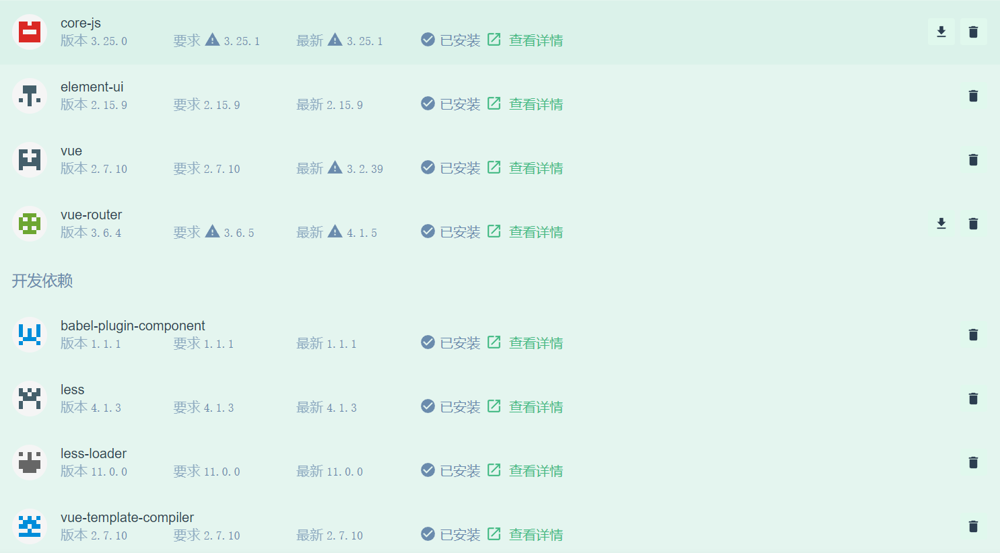
然后就可以开始写项目了

## 在项目中引入并配置axios插件

打开main.js文件，添加如下代码

```JavaScript
import axios from 'axios'

// 配置请求的根路径，，没部署在服务器，就在本地跑跑
axios.defaults.baseURL = 'http://127.0.0.1:8888/api/private/v1/'
// axios请求拦截
axios.interceptors.request.use(config => {
  // 为请求头对象，添加Token验证的Authorization字段，没有这个字段就无法发送请求
  config.headers.Authorization = window.sessionStorage.getItem('token')
  return config
})
// 挂载到vue示例上
Vue.prototype.$http = axios
```

## 配置路由

```JavaScript
import Vue from 'vue'
import VueRouter from 'vue-router'
// 以后把要用的组件全在这里引入一下


// 引用Vue
Vue.use(VueRouter)


const routes = [
    // 配置组件的路由关系
    // 主页默认是登录界面
    { path: '/', redirect: '/login' }
]

// 创建一个路由实例
const router = new VueRouter({
  routes
})

// 挂载路由导航守卫
// 如果有人没登录，但是通过url访问了登录后的界面，需要重定向到登录界面
router.beforeEach((to, from, next) => {
  // to代表将要访问的路径
  // from代表从哪个路径来
  // next是一个函数，表示放行
  //    next()放行 next('/login) 强制跳转

  if (to.path === '/login') return next()
  // 不是去登录界面，就获取token并判断
  const tokenStr = window.sessionStorage.getItem('token')
  if (!tokenStr) return next('/login')
  next()
})

export default router

```

## app.vue重写

删除默认的界面，并写入：

```vue
<template>
  <div id="app">
  <!-- 路由占位符 -->
    <router-view></router-view>
  </div>
</template>

<script>
export default {
  name: "app"
};
</script>

<style>
</style>

```

# 登录功能

## 新建一个Login.vue文件并配置路由

打开路由配置文件并写入

```JavaScript
import Login from '../components/Login'
const routes = [
  { path: '/', redirect: '/login' },
  { path: '/login', component: Login },
]


```

## 登录界面ui如下图

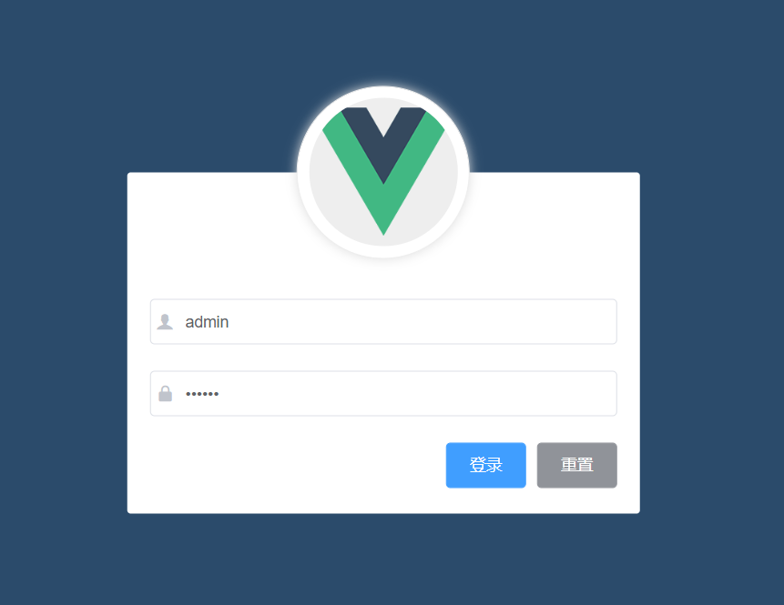
最上面就是个头像，由于后端没有写头像的接口，我也不会改，就写死了下面是一个form表单，输入用户名和密码后点击登录像后台发送请求验证，数据没错的话就提示登录成功，没这个人就登录失败。
有一说一，element-ui真好用，好多组件的代码能直接cv

## 登录表单的代码

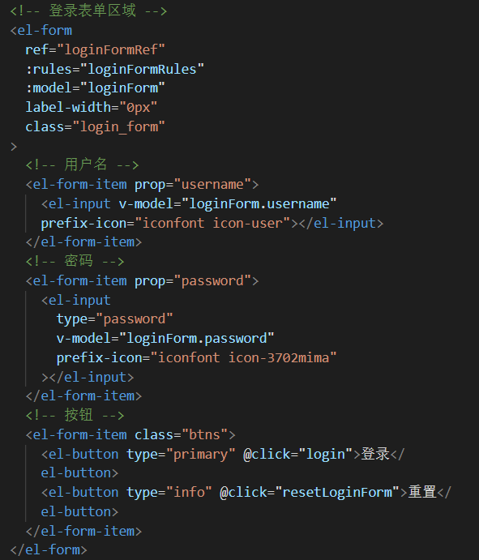
先给这个表单一个ref属性
:rules绑定表单的验证规则，需要在data里定义一个验证规则
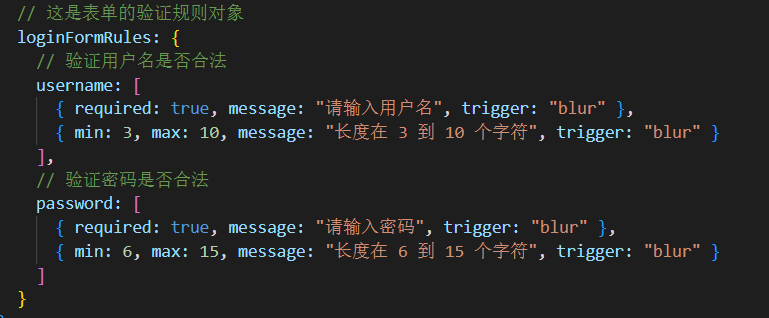
:model绑定这个表单的数据，也要在data里定义
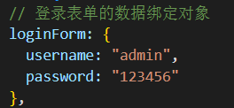
这里写死了是我懒得每次验证都要输一遍
每一个el-form-item用prop绑定一个验证规则，具体的就是loginFormRules里写的
下面的每一个el-input都用v-model双向绑定一个数据，就是el-form绑定的数据对象里的具体的数据
prefix-icon就是在输入框前面加一个小图标，elementui牛逼啊，这也太方便了！
最下面的两个按钮就是点击调用方法就行了

## login方法

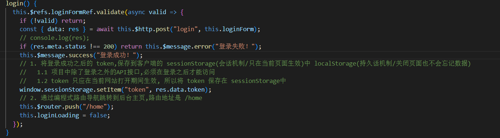
注释里啥都写了，就不多说了

## resetLoginForm方法

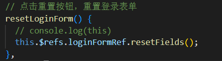
直接调用form表单的重置表单的方法就好了，太方便了

## 源码

```Vue
<template>
  <div class="login_container">
    <div class="login_box">
      <!-- 头像区域 -->
      <div class="avatar_box">
        
      </div>
      <!-- 登录表单区域 -->
      <el-form
        ref="loginFormRef"
        :rules="loginFormRules"
        :model="loginForm"
        label-width="0px"
        class="login_form"
      >
        <!-- 用户名 -->
        <el-form-item prop="username">
          <el-input v-model="loginForm.username" prefix-icon="iconfont icon-user"></el-input>
        </el-form-item>
        <!-- 密码 -->
        <el-form-item prop="password">
          <el-input
            type="password"
            v-model="loginForm.password"
            prefix-icon="iconfont icon-3702mima"
          ></el-input>
        </el-form-item>
        <!-- 按钮 -->
        <el-form-item class="btns">
          <el-button type="primary" @click="login">登录</el-button>
          <el-button type="info" @click="resetLoginForm">重置</el-button>
        </el-form-item>
      </el-form>
    </div>
  </div>
</template>

<script>
export default {
  data() {
    return {
      // 登录表单的数据绑定对象
      loginForm: {
        username: "admin",
        password: "123456"
      },
      // 这是表单的验证规则对象
      loginFormRules: {
        // 验证用户名是否合法
        username: [
          { required: true, message: "请输入用户名", trigger: "blur" },
          { min: 3, max: 10, message: "长度在 3 到 10 个字符", trigger: "blur" }
        ],
        // 验证密码是否合法
        password: [
          { required: true, message: "请输入密码", trigger: "blur" },
          { min: 6, max: 15, message: "长度在 6 到 15 个字符", trigger: "blur" }
        ]
      }
    };
  },
  methods: {
    // 点击重置按钮，重置登录表单
    resetLoginForm() {
      // console.log(this)
      this.$refs.loginFormRef.resetFields();
    },
    login() {
      // 验证表单
      this.$refs.loginFormRef.validate(async valid => {
        if (!valid) return;
        // 返回的是一个promise，用await来简化请求，方法用async修饰
        const { data: res } = await this.$http.post("login", this.loginForm);
        // console.log(res);
        if (res.meta.status !== 200) return this.$message.error("登录失败！");
        this.$message.success("登录成功！");
        // 1. 将登录成功之后的 token,保存到客户端的 sessionStorage(会话机制/只在当前页面生效)中 localStorage(持久话机制/关闭页面也不会忘记数据)
        //   1.1 项目中除了登录之外的API接口,必须在登录之后才能访问
        //   1.2 token 只应在当前网站打开期间生效, 所以将 token 保存在 sessionStorage中
        window.sessionStorage.setItem("token", res.data.token);
        // 2. 通过编程式路由导航跳转到后台主页,路由地址是 /home
        this.$router.push("/home");
        this.loginLoading = false;
      });
    }
  }
};
</script>

<style lang="less" scoped>
.login_container {
  background-color: #2b4b6b;
  height: 100%;
}
.login_box {
  width: 450px;
  height: 300px;
  background-color: #fff;
  border-radius: 3px;
  position: absolute;
  left: 50%;
  top: 50%;
  transform: translate(-50%, -50%);

  .avatar_box {
    height: 130px;
    width: 130px;
    border: 1px solid #eee;
    border-radius: 50%;
    padding: 10px;
    box-shadow: 0 0 10px #ddd;
    position: absolute;
    left: 50%;
    transform: translate(-50%, -50%);
    background-color: #fff;
    img {
      width: 100%;
      height: 100%;
      border-radius: 50%;
      background-color: #eee;
    }
  }
}

.login_form {
  position: absolute;
  bottom: 0;
  width: 100%;
  padding: 0 20px;
  box-sizing: border-box;
}

.btns {
  display: flex;
  justify-content: flex-end;
}
</style>
```

# 主页

主页的ui绘制如下
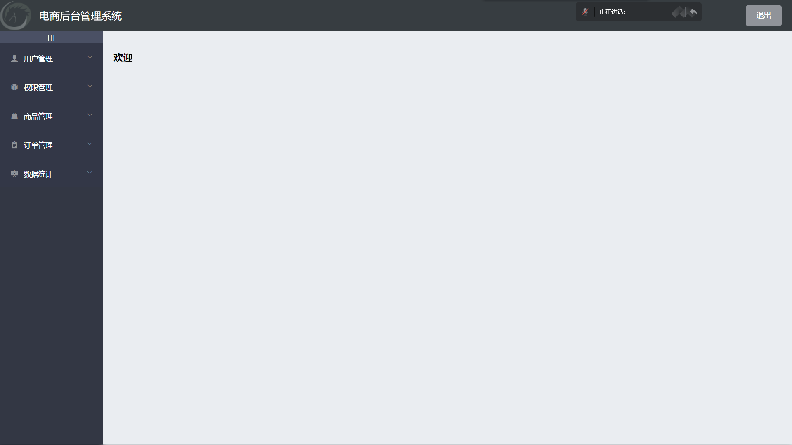
头部区域左边一个logo，右边是退出功能，布局代码如下
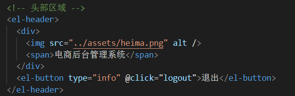

## 退出功能的实现

点击退出按钮退出当前登录的账号，给button按钮绑定一个logout方法  
logout方法代码如下
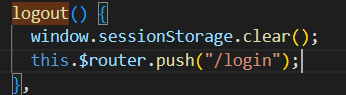
登录的状态是写在浏览器的sessionStorage里写入的token字段，所以只要把session清除就好了，应该没有哪个der会登两个号，所以全清了问题不大。清完了然后再将路由重定向到登录界面就好了。

## 侧边栏区域

侧边栏是个菜单区域，使用的事el-menu组件；菜单里会有多级菜单，多级菜单使用el-submenu组件实现
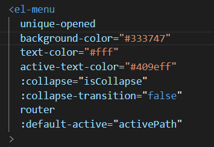

* 由于会有多级菜单，所以默认只保持一个子菜单展开，为el-menu添加unique-opened属性
* 有的时候浏览右侧主体区的时候会想把左边的菜单折叠。所以绑定一个collapse属性，值动态绑定布尔值isCollapse，点击菜单上面的按钮就会收起菜单
  这是菜单上边的按钮
  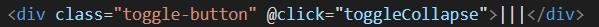
  点击按钮调用toggleCollapse方法，修改isCollaspe的值
  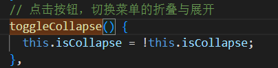
  然后这个组件的折叠动画我感觉有点卡，就是很丑，所以我把动画关了，通过css为侧边菜单添加transition: 0.5s;这样就流畅多了
* 想要实现点击一个选项就展示一个页面，就可以开启路由属性，一个个绑定太麻烦了，官方都给我们写好了
* 将当前激活的连接地址复制给一个变量
  
多级菜单使用el-submenu组件实现
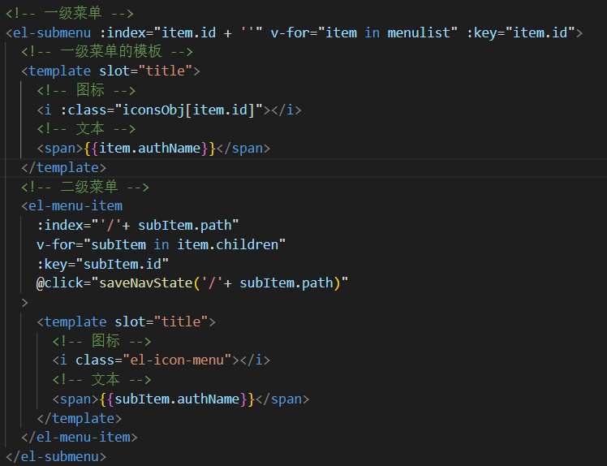
菜单会在页面渲染前调用后端的api请求菜单数据存放在menulist数组里，使用created生命周期钩子函数调用获取菜单列表的方法
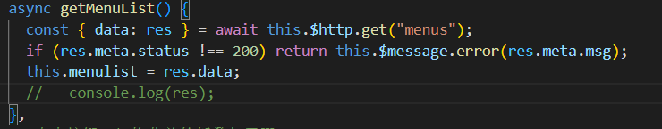
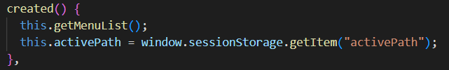
为了更好的用户体验，将当前打开的链接保存到sessionStorage里，这样用户刷新的时候页面还会打开原来的界面
使用v-for遍历menulist数组，再用作用域插槽的方法，动态展示一级菜单
菜单前的icon图标就要自己绑定了，也不算烦，定义一个对象，根据每一个菜单的id赋值就好
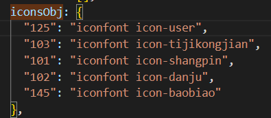
菜单的标题就使用插值语法绑定请求到的名称就行
然后是二级菜单
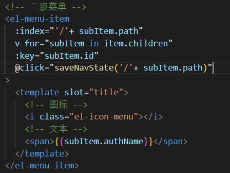
由于在菜单开启了路由选项，点击会自动访问index所绑定的路径，这里后端给我们返回了，我们可以直接绑定，记得要加一个“/”表示路径
点击二级菜单的链接就要更新一下sessionStorage的activepath，即点击后调用saveNavState方法
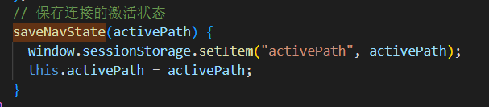
渲染方式和一级菜单差不多

到此为止侧边栏就完成了，对了还有个路由记得写一下
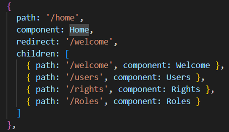
下面的事以后要用的子路由，还没全写完。默认的打开的是welcome组件，我是菜鸡，想不出好看的welcome界面，就很简单的水了一下，诶嘿~
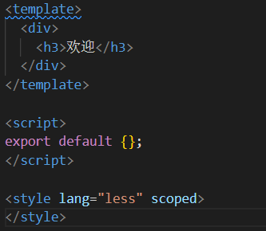

## 右侧的主体内容

右侧的很简单，放个路由占位符就好了
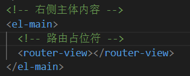

## 源码

```vue
<template>
  <el-container class="home-container">
    <!-- 头部区域 -->
    <el-header>
      <div>
        
        <span>电商后台管理系统</span>
      </div>
      <el-button type="info" @click="logout">退出</el-button>
    </el-header>
    <!-- 页面主体区 -->
    <el-container>
      <!-- 侧边栏 -->
      <el-aside :width="isCollapse ? '64px' : '200px'">
        <div class="toggle-button" @click="toggleCollapse">|||</div>
        <!-- 侧边栏菜单区 -->
        <el-menu
          unique-opened
          background-color="#333747"
          text-color="#fff"
          active-text-color="#409eff"
          :collapse="isCollapse"
          :collapse-transition="false"
          router
          :default-active="activePath"
        >
          <!-- 一级菜单 -->
          <el-submenu :index="item.id + ''" v-for="item in menulist" :key="item.id">
            <!-- 一级菜单的模板 -->
            <template slot="title">
              <!-- 图标 -->
              <i :class="iconsObj[item.id]"></i>
              <!-- 文本 -->
              <span>{{item.authName}}</span>
            </template>
            <!-- 二级菜单 -->
            <el-menu-item
              :index="'/'+ subItem.path"
              v-for="subItem in item.children"
              :key="subItem.id"
              @click="saveNavState('/'+ subItem.path)"
            >
              <template slot="title">
                <!-- 图标 -->
                <i class="el-icon-menu"></i>
                <!-- 文本 -->
                <span>{{subItem.authName}}</span>
              </template>
            </el-menu-item>
          </el-submenu>
        </el-menu>
      </el-aside>
      <!-- 右侧主体内容 -->
      <el-main>
        <!-- 路由占位符 -->
        <router-view></router-view>
      </el-main>
    </el-container>
  </el-container>
</template>

<script>
export default {
  data() {
    return {
      // 左侧菜单数据
      menulist: [],
      iconsObj: {
        "125": "iconfont icon-user",
        "103": "iconfont icon-tijikongjian",
        "101": "iconfont icon-shangpin",
        "102": "iconfont icon-danju",
        "145": "iconfont icon-baobiao"
      },
      //   是否折叠
      isCollapse: false,
      // 被激活的连接地址
      activePath: ""
    };
  },
  created() {
    this.getMenuList();
    this.activePath = window.sessionStorage.getItem("activePath");
  },
  methods: {
    logout() {
      window.sessionStorage.clear();
      this.$router.push("/login");
    },
    async getMenuList() {
      const { data: res } = await this.$http.get("menus");
      if (res.meta.status !== 200) return this.$message.error(res.meta.msg);
      this.menulist = res.data;
      //   console.log(res);
    },
    // 点击按钮，切换菜单的折叠与展开
    toggleCollapse() {
      this.isCollapse = !this.isCollapse;
    },
    // 保存连接的激活状态
    saveNavState(activePath) {
      window.sessionStorage.setItem("activePath", activePath);
      this.activePath = activePath;
    }
  }
};
</script>

<style lang="less" scoped>
.home-container {
  height: 100%;
}
.el-header {
  background-color: #373d41;
  display: flex;
  justify-content: space-between;
  padding-left: 0;
  align-items: center;
  color: #fff;
  font-size: 20px;
  > div {
    display: flex;
    align-items: center;
    span {
      margin-left: 15px;
    }
  }
}
.el-aside {
  background-color: #333744;
  transition: 0.5s;
  .el-menu {
    border-right: none;
  }
}
.el-main {
  background-color: #eaedf1;
}
.iconfont {
  margin-right: 10px;
}

.toggle-button {
  background-color: #4a5064;
  font-size: 10px;
  line-height: 24px;
  color: #fff;
  text-align: center;
  letter-spacing: 0.2em;
  cursor: pointer;
}
</style>
```

这样主页就完成了，接下来就是大工程了，开始实现电商后台管理系统的具体功能了。

# 用户管理模块

用户管理模块是展示在主页的右侧，主页通过点击左侧的菜单可以访问，ui绘制如下
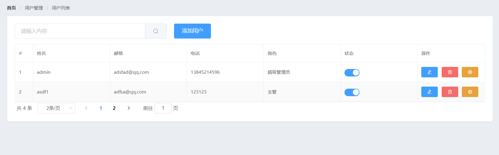

## 面包屑导航

最上边是一个面包屑导航，使用el-breadcrumb组件完成
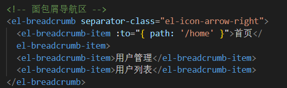
然后点击首页是可以跳转的，所以指定一下跳转的路径
下面所有的是一个卡片视图，使用卡片视图是为了方便布局，用的是el-card组件。就不放截图了，不太好截，去源码自己看看吧。

## 搜索与添加区域

### 搜索功能

使用的事Layout 布局组件el-row和el-col
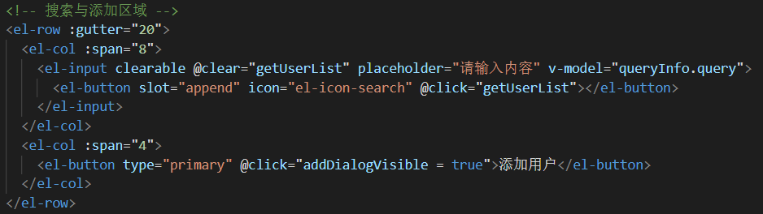
:gutter="20"属性制定了栅格间的间距为20
这个组件把整个页面分成24格，这和bootstrap有点像，前面的搜索区域占8格，通过:span指定
这一列里含有一个搜索输入框和一个搜索按钮，其中为了更好的体验，添加了可以清空的属性，就是clearable，清空后出发clear事件，调用getUserList方法
getUserList方法定义如下：
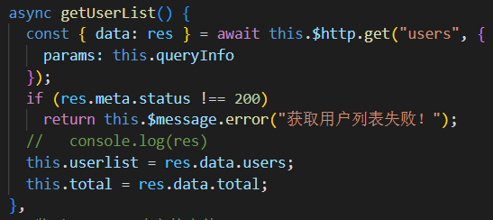
首先调用api接口获取用户列表  
然后将获取到的列表信息和总的用户数赋值给data
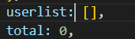

搜索框输入的内容双向绑定到data里  
我们想要搜索的按钮在右边，所以可以添加slot="append"这个属性，点击按钮就可以调用getUserList方法，这里因为后端接口，所以可以直接写。后端会根据你的query返回对应的用户

### 添加用户功能

首先是一个button
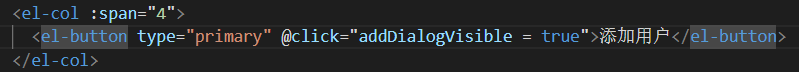
实现的功能是点击按钮打开一个对话框，我们用addDialogVisible这个布尔值来控制对话框的显示与隐藏。然后就是这个对话框是啥样的
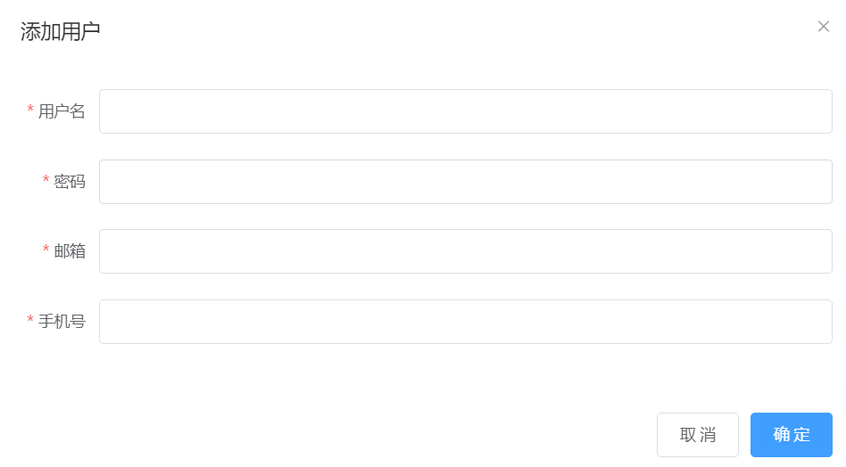
对话框使用的是el-dialog组件。主体就是一个表单。
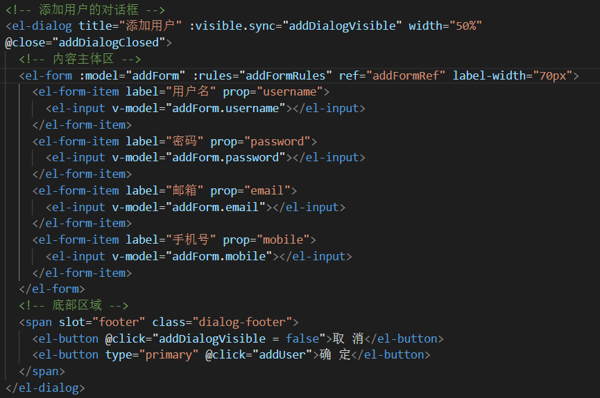
title设置为添加用户
:visible.sync="addDialogVisible"来判断什么时候显示或隐藏这个对话框，当关闭后要出发close事件调用addDialogClosed方法
addDialogClosed定义如下：
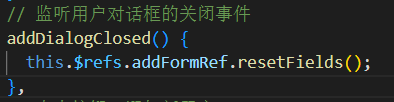
就是重置这个表单，防止下次打开的时候上一次输入的内容还在
表单里的功能和登录差不多，说一下邮箱和手机号的验证。这里用的是自定义验证规则，通过正则验证邮箱和手机号是否正确
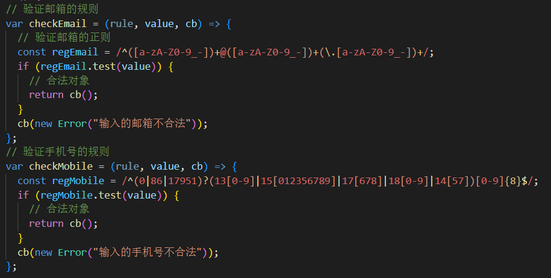
定义俩函数，value是输入的值，cb是一个回调函数，没错的话直接运行，出错的话新建一个错误的对象
关于正则表达式，可以查看[菜鸟教程](https://www.runoob.com/regexp/regexp-tutorial.html)
验证规则对象这么写
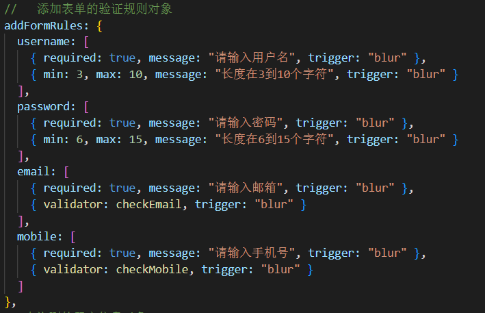
validator可以自定义验证规则
点击确定调用addUser方法
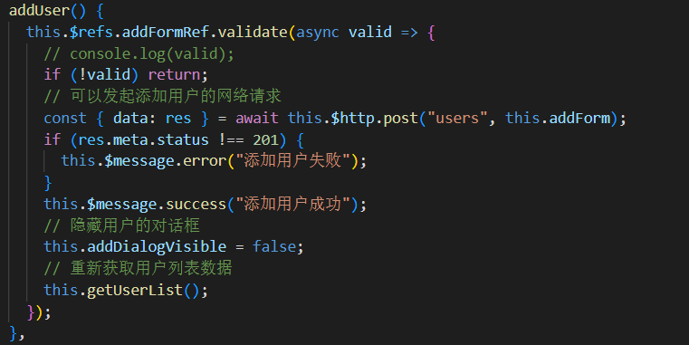
首先验证表单，然后向后端发请求，请求成功隐藏对话框并刷新数据

## 用户列表

### 基本数据

用户列表使用el-table组件
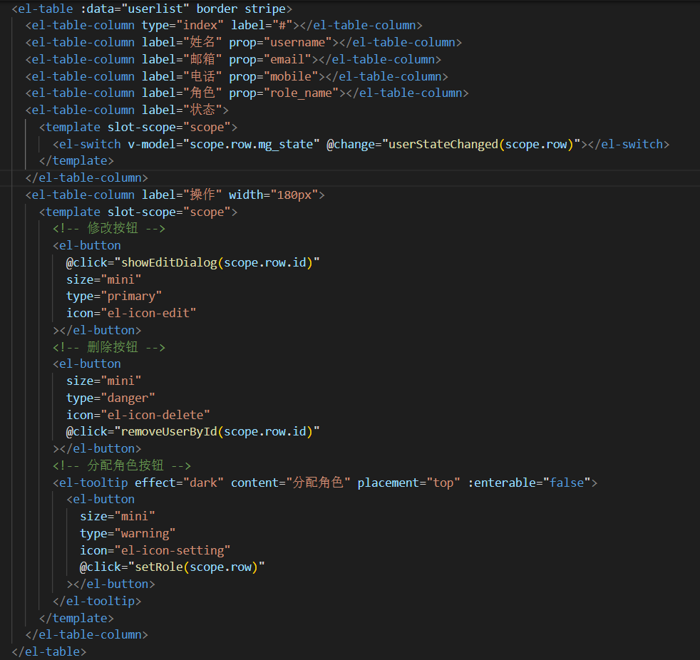
:data绑定列表数据。border添加表格边框，stripe各行变色，就是为了美化这个表格的
具体的内容使用el-table-column这个组件，首先添加一个索引列，直接type="index"就好
姓名，邮箱，电话，角色都是可以直接渲染的，不用额外设置

### 状态栏

状态那一栏里，后端给我们返回的是一个布尔值，我们可以使用作用域插槽把他渲染成一个switch开关
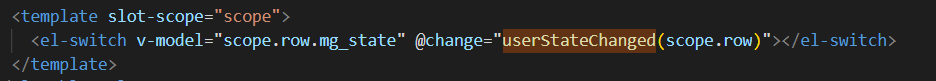
slot-scope="scope"是为了获取这一行的信息，后端返回的状态布尔值是mg_state，所以我们把他双向绑定。通过监听change事件来调用userStateChanged向后端发送put请求改变当前的状态
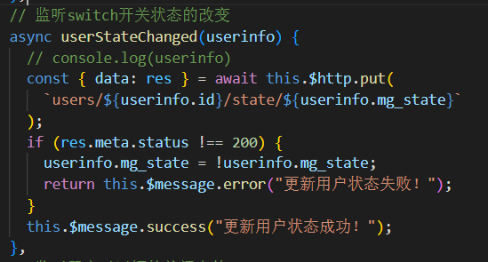
请求成功直接取反就好

### 操作栏

操作栏含有三个按钮，修改，删除，分配角色
首先也是使用作用域插槽渲染成三个按钮的样式
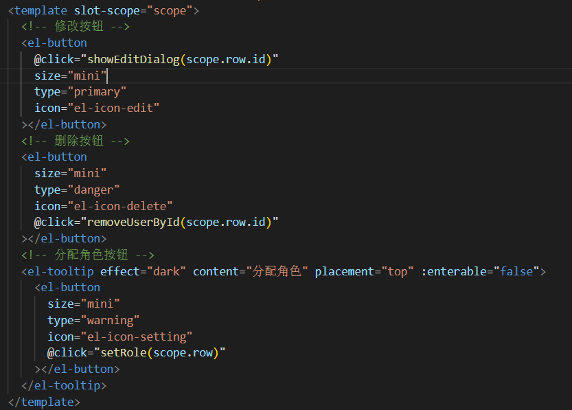
然后就是具体的渲染三个按钮

#### 修改

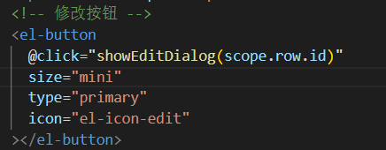
想要按钮小一点，添加size="mini"，点击按钮调用showEditDialog方法并传入这一列的值。对话框里首先要获取当前角色的信息，所以将基础信息赋值给data方便修改
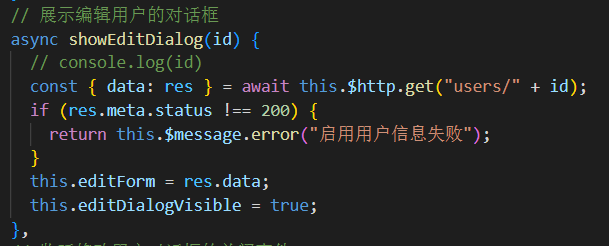
与添加用户类似，也是点击后弹出一个对话框
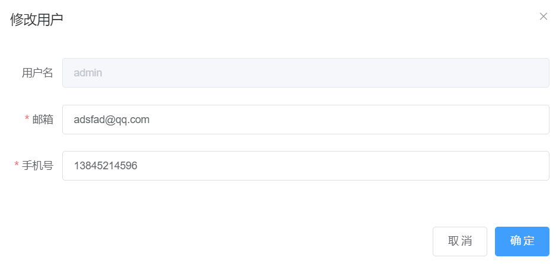

对话框里首先要获取当前角色的信息
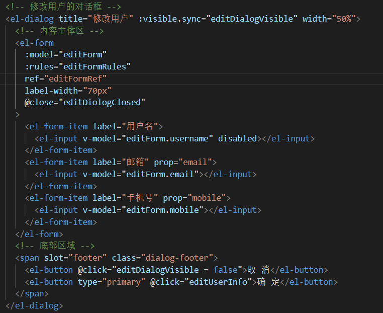
实现功能和添加用户类似，就不多赘述

#### 删除

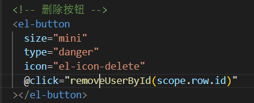
点击删除按钮调用removeUserById方法并传入这一列的值
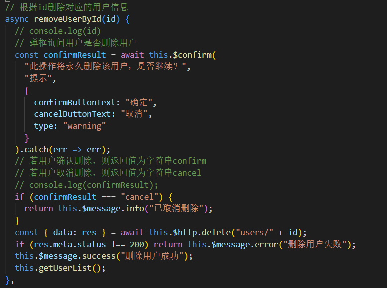
防止用户的误触，我们需要弹出一个弹框来询问用户是否确认删除
使用this.$confirm来弹出弹框。若用户确认删除，则返回值为字符串confirm；若用户取消删除，则返回值为字符串cancel。所以可以通过判断返回的字符串来判断是否调用api
若用户确认删除，则向后端发送delete请求，删除该用户。
删除成功后刷新用户列表

#### 分配角色

分配角色里的角色来自于权限管理模块里的角色列表
由于用户可能不懂这个图标是个什么意思，所以使用Tooltip组件
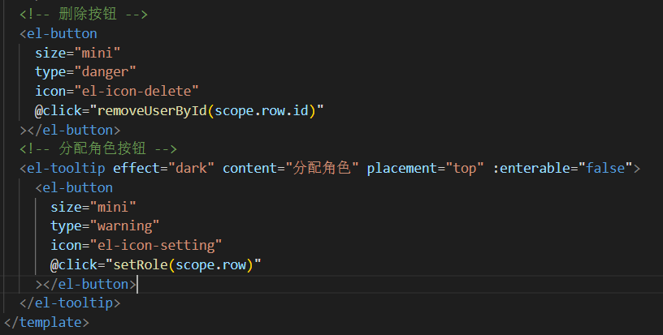
为了防止下面的提示会覆盖上面的图标，所以将enterable设置为false，即不允许鼠标进入Tooltip提示
点击按钮调用setRole方法弹出分配角色的对话框
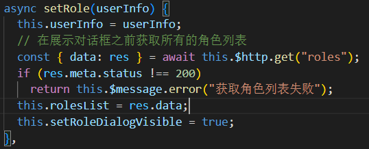
要先获取可选的角色，赋值给data，方便渲染
点击按钮弹出对话框
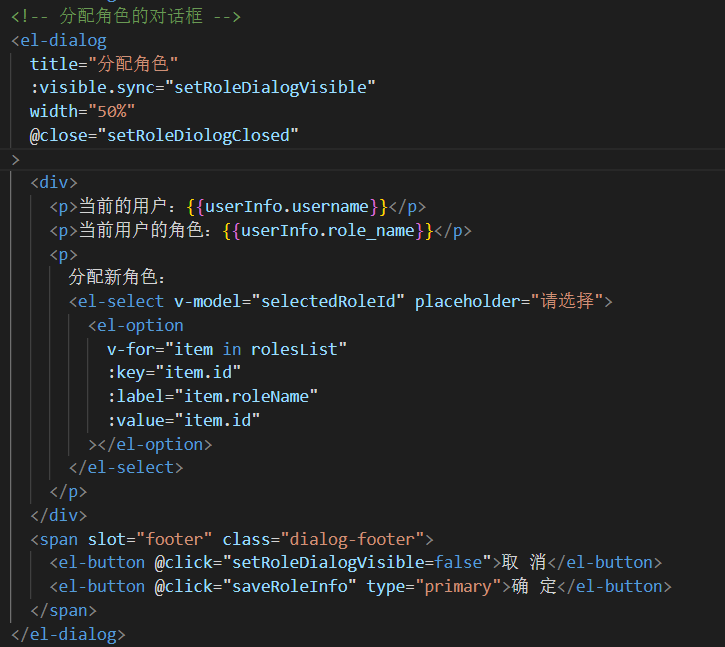
分配角色是一个下拉框，使用el-select组件
将分配的新角色绑定到data中
选项则是通过v-for遍历获取到的角色，动态渲染
选项的文本是item.roleName，即获取到的roleName，value的值就是传给el-select绑定的值，这里绑定的是id
点击确定后调用saveRoleInfo方法
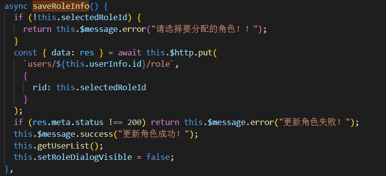
先验证selectedRoleId是否为空，为空就让用户选择，不为空则向后端发送put请求。然后刷新列表，关闭对话框
当对话框关闭时，调用setRoleDiologClosed方法
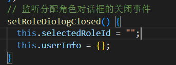
清空选择的角色id和用户信息

至此用户管理模块完成

## 源码

```Vue
<template>
  <div>
    <!-- 面包屑导航区 -->
    <el-breadcrumb separator-class="el-icon-arrow-right">
      <el-breadcrumb-item :to="{ path: '/home' }">首页</el-breadcrumb-item>
      <el-breadcrumb-item>用户管理</el-breadcrumb-item>
      <el-breadcrumb-item>用户列表</el-breadcrumb-item>
    </el-breadcrumb>
    <!-- 卡片视图区 -->
    <el-card>
      <!-- 搜索与添加区域 -->
      <el-row :gutter="20">
        <el-col :span="8">
          <el-input clearable @clear="getUserList" placeholder="请输入内容" v-model="queryInfo.query">
            <el-button slot="append" icon="el-icon-search" @click="getUserList"></el-button>
          </el-input>
        </el-col>
        <el-col :span="4">
          <el-button type="primary" @click="addDialogVisible = true">添加用户</el-button>
        </el-col>
      </el-row>
      <!-- 用户列表区域 -->
      <el-table :data="userlist" border stripe>
        <el-table-column type="index" label="#"></el-table-column>
        <el-table-column label="姓名" prop="username"></el-table-column>
        <el-table-column label="邮箱" prop="email"></el-table-column>
        <el-table-column label="电话" prop="mobile"></el-table-column>
        <el-table-column label="角色" prop="role_name"></el-table-column>
        <el-table-column label="状态">
          <template slot-scope="scope">
            <el-switch v-model="scope.row.mg_state" @change="userStateChanged(scope.row)"></el-switch>
          </template>
        </el-table-column>
        <el-table-column label="操作" width="180px">
          <template slot-scope="scope">
            <!-- 修改按钮 -->
            <el-button
              @click="showEditDialog(scope.row.id)"
              size="mini"
              type="primary"
              icon="el-icon-edit"
            ></el-button>
            <!-- 删除按钮 -->
            <el-button
              size="mini"
              type="danger"
              icon="el-icon-delete"
              @click="removeUserById(scope.row.id)"
            ></el-button>
            <!-- 分配角色按钮 -->
            <el-tooltip effect="dark" content="分配角色" placement="top" :enterable="false">
              <el-button
                size="mini"
                type="warning"
                icon="el-icon-setting"
                @click="setRole(scope.row)"
              ></el-button>
            </el-tooltip>
          </template>
        </el-table-column>
      </el-table>
      <!-- 分页区域 -->
      <el-pagination
        @size-change="handleSizeChange"
        @current-change="handleCurrentChange"
        :current-page="queryInfo.pagenum"
        :page-sizes="[1, 2, 5, 10]"
        :page-size="queryInfo.pagesize"
        layout="total, sizes, prev, pager, next, jumper"
        :total="total"
      ></el-pagination>
    </el-card>
    <!-- 添加用户的对话框 -->
    <el-dialog title="添加用户" :visible.sync="addDialogVisible" width="50%" @close="addDialogClosed">
      <!-- 内容主体区 -->
      <el-form :model="addForm" :rules="addFormRules" ref="addFormRef" label-width="70px">
        <el-form-item label="用户名" prop="username">
          <el-input v-model="addForm.username"></el-input>
        </el-form-item>
        <el-form-item label="密码" prop="password">
          <el-input v-model="addForm.password"></el-input>
        </el-form-item>
        <el-form-item label="邮箱" prop="email">
          <el-input v-model="addForm.email"></el-input>
        </el-form-item>
        <el-form-item label="手机号" prop="mobile">
          <el-input v-model="addForm.mobile"></el-input>
        </el-form-item>
      </el-form>
      <!-- 底部区域 -->
      <span slot="footer" class="dialog-footer">
        <el-button @click="addDialogVisible = false">取 消</el-button>
        <el-button type="primary" @click="addUser">确 定</el-button>
      </span>
    </el-dialog>
    <!-- 修改用户的对话框 -->
    <el-dialog title="修改用户" :visible.sync="editDialogVisible" width="50%">
      <!-- 内容主体区 -->
      <el-form
        :model="editForm"
        :rules="editFormRules"
        ref="editFormRef"
        label-width="70px"
        @close="editDiologClosed"
      >
        <el-form-item label="用户名">
          <el-input v-model="editForm.username" disabled></el-input>
        </el-form-item>
        <el-form-item label="邮箱" prop="email">
          <el-input v-model="editForm.email"></el-input>
        </el-form-item>
        <el-form-item label="手机号" prop="mobile">
          <el-input v-model="editForm.mobile"></el-input>
        </el-form-item>
      </el-form>
      <!-- 底部区域 -->
      <span slot="footer" class="dialog-footer">
        <el-button @click="editDialogVisible = false">取 消</el-button>
        <el-button type="primary" @click="editUserInfo">确 定</el-button>
      </span>
    </el-dialog>
    <!-- 分配角色的对话框 -->
    <el-dialog
      title="分配角色"
      :visible.sync="setRoleDialogVisible"
      width="50%"
      @close="setRoleDiologClosed"
    >
      <div>
        <p>当前的用户：{{userInfo.username}}</p>
        <p>当前用户的角色：{{userInfo.role_name}}</p>
        <p>
          分配新角色：
          <el-select v-model="selectedRoleId" placeholder="请选择">
            <el-option
              v-for="item in rolesList"
              :key="item.id"
              :label="item.roleName"
              :value="item.id"
            ></el-option>
          </el-select>
        </p>
      </div>
      <span slot="footer" class="dialog-footer">
        <el-button @click="setRoleDialogVisible=false">取 消</el-button>
        <el-button @click="saveRoleInfo" type="primary">确 定</el-button>
      </span>
    </el-dialog>
  </div>
</template>

<script>
export default {
  data() {
    // 验证邮箱的规则
    var checkEmail = (rule, value, cb) => {
      // 验证邮箱的正则
      const regEmail = /^([a-zA-Z0-9_-])+@([a-zA-Z0-9_-])+(\.[a-zA-Z0-9_-])+/;
      if (regEmail.test(value)) {
        // 合法对象
        return cb();
      }
      cb(new Error("输入的邮箱不合法"));
    };
    // 验证手机号的规则
    var checkMobile = (rule, value, cb) => {
      const regMobile = /^(0|86|17951)?(13[0-9]|15[012356789]|17[678]|18[0-9]|14[57])[0-9]{8}$/;
      if (regMobile.test(value)) {
        // 合法对象
        return cb();
      }
      cb(new Error("输入的手机号不合法"));
    };

    return {
      // 获取用户列表的参数对象
      queryInfo: {
        query: "",
        // 当前的页数
        pagenum: 1,
        // 当前每页显示多少条数据
        pagesize: 2
      },
      userlist: [],
      total: 0,
      //   控制添加用户对话框的显示与隐藏
      addDialogVisible: false,
      //   控制修改用户对话框的显示与隐藏
      editDialogVisible: false,
      //   控制分配角色对话框的显示与隐藏
      setRoleDialogVisible: false,
      //   添加用户的表单数据
      addForm: {
        username: "",
        password: "",
        email: "",
        mobile: ""
      },
      //   添加表单的验证规则对象
      addFormRules: {
        username: [
          { required: true, message: "请输入用户名", trigger: "blur" },
          { min: 3, max: 10, message: "长度在3到10个字符", trigger: "blur" }
        ],
        password: [
          { required: true, message: "请输入密码", trigger: "blur" },
          { min: 6, max: 15, message: "长度在6到15个字符", trigger: "blur" }
        ],
        email: [
          { required: true, message: "请输入邮箱", trigger: "blur" },
          { validator: checkEmail, trigger: "blur" }
        ],
        mobile: [
          { required: true, message: "请输入手机号", trigger: "blur" },
          { validator: checkMobile, trigger: "blur" }
        ]
      },
      // 查询到的用户信息对象
      editForm: {},
      // 修改表单的验证规则对象
      editFormRules: {
        email: [
          { required: true, message: "请输入邮箱", trigger: "blur" },
          { validator: checkEmail, trigger: "blur" }
        ],
        mobile: [
          { required: true, message: "请输入手机号", trigger: "blur" },
          { validator: checkMobile, trigger: "blur" }
        ]
      },
      // 需要被分配角色的用户信息
      userInfo: {},
      // 所有角色的数据列表
      rolesList: [],
      // 已选中的角色id值
      selectedRoleId: ""
    };
  },
  created() {
    this.getUserList();
  },
  methods: {
    async getUserList() {
      const { data: res } = await this.$http.get("users", {
        params: this.queryInfo
      });
      if (res.meta.status !== 200)
        return this.$message.error("获取用户列表失败！");
      //   console.log(res)
      this.userlist = res.data.users;
      this.total = res.data.total;
    },
    // 监听pagesize改变的事件
    handleSizeChange(newSize) {
      //   console.log(newSize);
      this.queryInfo.pagesize = newSize;
      this.getUserList();
    },
    // 监听页码值改变的事件
    handleCurrentChange(newPage) {
      //   console.log(newPage);
      this.queryInfo.pagenum = newPage;
      this.getUserList();
    },
    // 监听switch开关状态的改变
    async userStateChanged(userinfo) {
      // console.log(userinfo)
      const { data: res } = await this.$http.put(
        `users/${userinfo.id}/state/${userinfo.mg_state}`
      );
      if (res.meta.status !== 200) {
        userinfo.mg_state = !userinfo.mg_state;
        return this.$message.error("更新用户状态失败！");
      }
      this.$message.success("更新用户状态成功！");
    },
    // 监听用户对话框的关闭事件
    addDialogClosed() {
      this.$refs.addFormRef.resetFields();
    },
    // 点击按钮，添加新用户
    addUser() {
      this.$refs.addFormRef.validate(async valid => {
        // console.log(valid);
        if (!valid) return;
        // 可以发起添加用户的网络请求
        const { data: res } = await this.$http.post("users", this.addForm);
        if (res.meta.status !== 201) {
          this.$message.error("添加用户失败");
        }
        this.$message.success("添加用户成功");
        // 隐藏用户的对话框
        this.addDialogVisible = false;
        // 重新获取用户列表数据
        this.getUserList();
      });
    },
    // 展示编辑用户的对话框
    async showEditDialog(id) {
      // console.log(id)
      const { data: res } = await this.$http.get("users/" + id);
      if (res.meta.status !== 200) {
        return this.$message.error("启用用户信息失败");
      }
      this.editForm = res.data;
      this.editDialogVisible = true;
    },
    // 监听修改用户对话框的关闭事件
    editDiologClosed() {
      this.$refs.editFormRef.resetFields();
    },
    // 修改用户信息并提交
    editUserInfo() {
      this.$refs.editFormRef.validate(async valid => {
        // console.log(valid)
        if (!valid) return;
        // 发起修改用户的数据请求
        const { data: res } = await this.$http.put(
          "users/" + this.editForm.id,
          {
            email: this.editForm.email,
            mobile: this.editForm.mobile
          }
        );
        if (res.meta.status !== 200) {
          return this.$message.error("更新用户失败！");
        }
        // 关闭对话框
        this.editDialogVisible = false;
        // 刷新数据列表
        this.getUserList();
        // 提示修改成功
        this.$message.success("更新用户信息成功！");
      });
    },
    // 根据id删除对应的用户信息
    async removeUserById(id) {
      // console.log(id)
      // 弹框询问用户是否删除用户
      const confirmResult = await this.$confirm(
        "此操作将永久删除该用户，是否继续？",
        "提示",
        {
          confirmButtonText: "确定",
          cancelButtonText: "取消",
          type: "warning"
        }
      ).catch(err => err);
      // 若用户确认删除，则返回值为字符串confirm
      // 若用户取消删除，则返回值为字符串cancel
      // console.log(confirmResult);
      if (confirmResult === "cancel") {
        return this.$message.info("已取消删除");
      }
      const { data: res } = await this.$http.delete("users/" + id);
      if (res.meta.status !== 200) return this.$message.error("删除用户失败");
      this.$message.success("删除用户成功");
      this.getUserList();
    },
    async setRole(userInfo) {
      this.userInfo = userInfo;
      // 在展示对话框之前获取所有的角色列表
      const { data: res } = await this.$http.get("roles");
      if (res.meta.status !== 200)
        return this.$message.error("获取角色列表失败");
      this.rolesList = res.data;
      this.setRoleDialogVisible = true;
    },
    async saveRoleInfo() {
      if (!this.selectedRoleId) {
        return this.$message.error("请选择要分配的角色！！");
      }
      const { data: res } = await this.$http.put(
        `users/${this.userInfo.id}/role`,
        {
          rid: this.selectedRoleId
        }
      );
      if (res.meta.status !== 200) return this.$message.error("更新角色失败！");
      this.$message.success("更新角色成功！");
      this.getUserList();
      this.setRoleDialogVisible = false;
    },
    // 监听分配角色对话框的关闭事件
    setRoleDiologClosed() {
      this.selectedRoleId = "";
      this.userInfo = {};
    }
  }
};
</script>

<style lang="less" scoped>
</style>
```

# 权限管理模块

权限管理模块分为权限列表和角色列表

## 权限列表

ui绘制如下
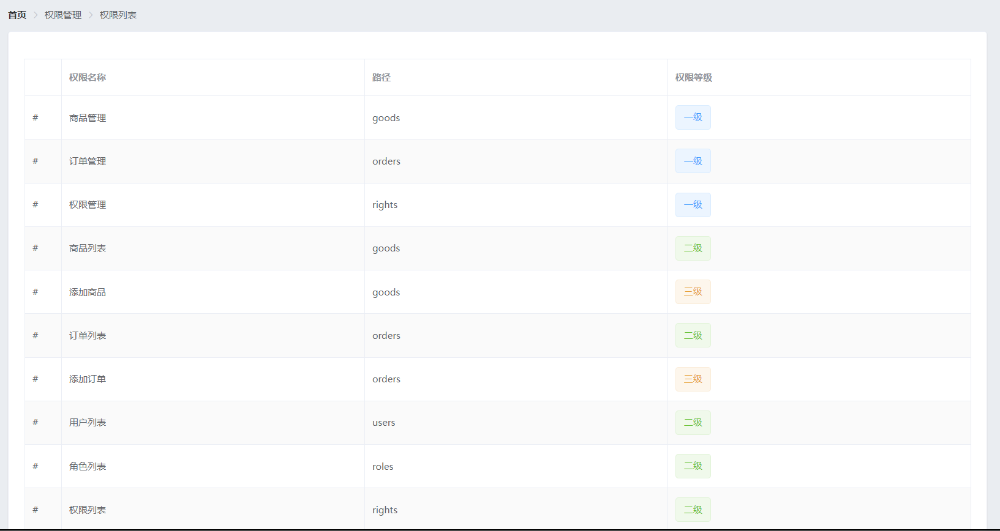
最上面是一个面包屑导航
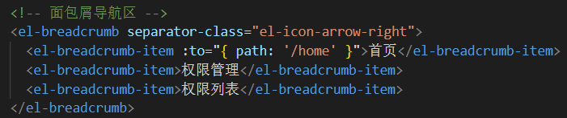
下面是一个卡片视图
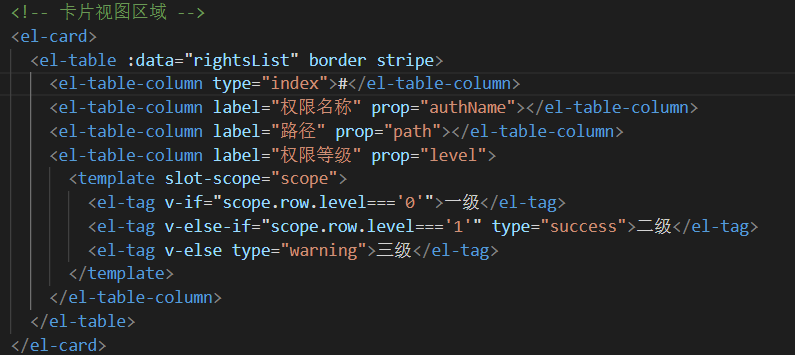
名称路径默认渲染就好，权限等级后端返回的事0，1，2来区分的，我们可以用el-tag加v-if来美化一下
判断当前的权限等级的代号，然后动态渲染

在渲染页面前要准备数据
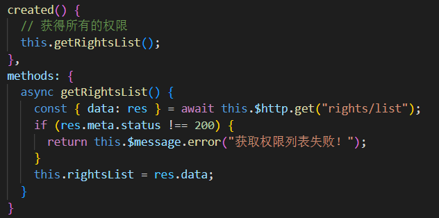
使用created钩子向后端发送请求，赋值给data，然后根据请求到的 00000000                                                   数据渲染

### 源码

```vue
<template>
  <div>
    <!-- 面包屑导航区 -->
    <el-breadcrumb separator-class="el-icon-arrow-right">
      <el-breadcrumb-item :to="{ path: '/home' }">首页</el-breadcrumb-item>
      <el-breadcrumb-item>权限管理</el-breadcrumb-item>
      <el-breadcrumb-item>权限列表</el-breadcrumb-item>
    </el-breadcrumb>
    <!-- 卡片视图区域 -->
    <el-card>
      <el-table :data="rightsList" border stripe>
        <el-table-column type="index">#</el-table-column>
        <el-table-column label="权限名称" prop="authName"></el-table-column>
        <el-table-column label="路径" prop="path"></el-table-column>
        <el-table-column label="权限等级" prop="level">
          <template slot-scope="scope">
            <el-tag v-if="scope.row.level==='0'">一级</el-tag>
            <el-tag v-else-if="scope.row.level==='1'" type="success">二级</el-tag>
            <el-tag v-else type="warning">三级</el-tag>
          </template>
        </el-table-column>
      </el-table>
    </el-card>
  </div>
</template>

<script>
export default {
  data() {
    return {
      // 权限列表
      rightsList: []
    };
  },
  created() {
    // 获得所有的权限
    this.getRightsList();
  },
  methods: {
    async getRightsList() {
      const { data: res } = await this.$http.get("rights/list");
      if (res.meta.status !== 200) {
        return this.$message.error("获取权限列表失败！");
      }
      this.rightsList = res.data;
    }
  }
};
</script>

<style lang="less" scoped>
</style>
```

## 角色列表

角色的列表的ui绘制如下
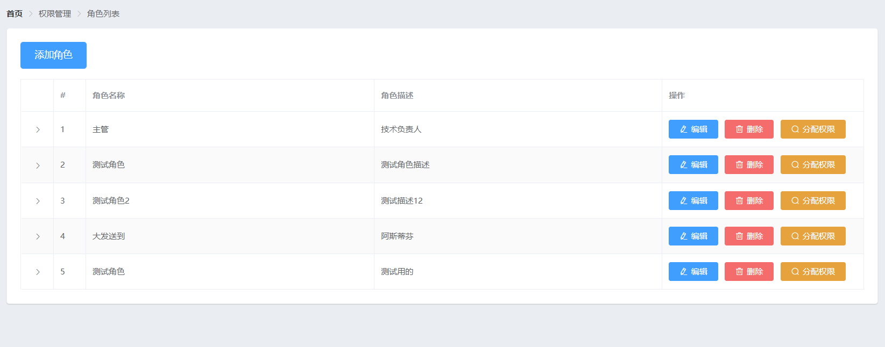
同样的，最上边是个面包屑导航
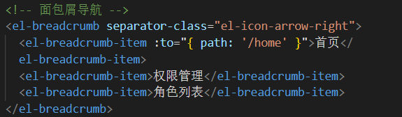
下面的区域用el-card当容器

### 添加角色

添加角色的逻辑和用户管理模块的添加用户的实现逻辑类似，点击弹出dialog对话框
代码如下，上边是一个form表单，点击确定发送请求。不多赘述
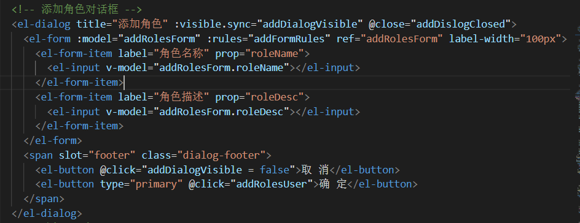
ui如下
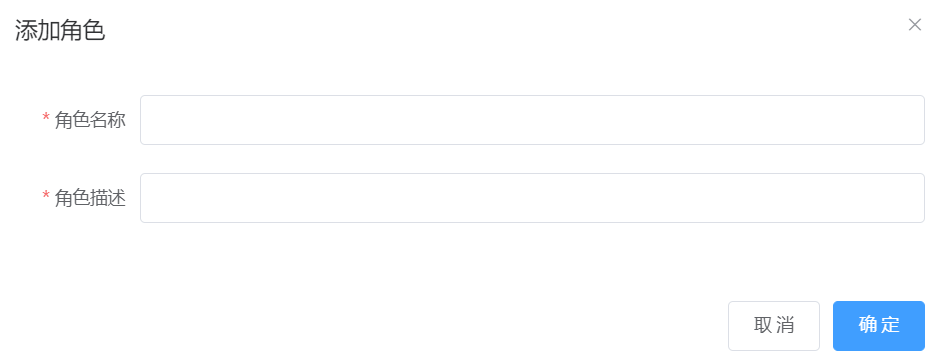

### 角色列表

角色列表使用el-table组件
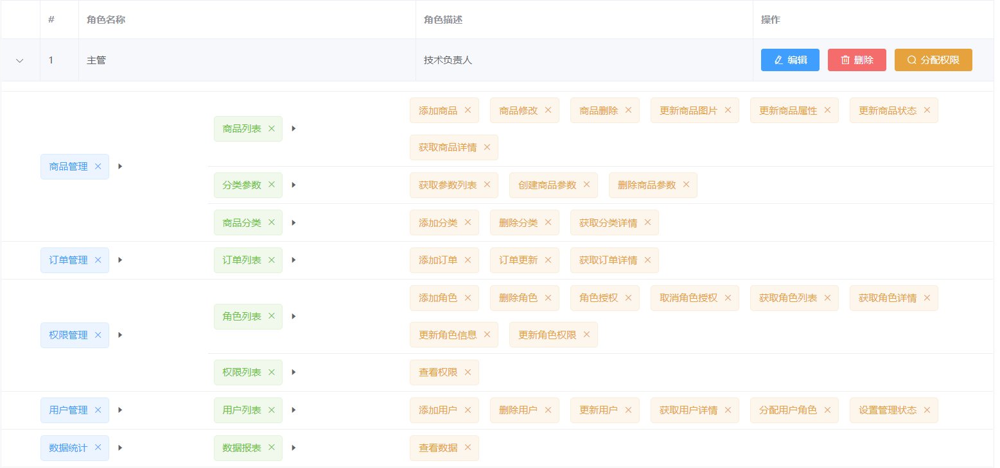
要求点击列表嘴前方的按钮可以查看具体的权限，给el-table-column绑定type="expand"，即可展开列表。然后使用作用域插槽渲染权限列表。代码太长，就不截图了

#### 渲染权限列表

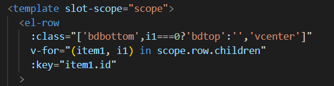
遍历角色的children属性，这里面存的角色的权限，
我们想给权限的列表添加分割线，首先给每一个权限添加底部的边框，然后用三元运算符给第一个权限添加上边框，并且将权限居中
对应的样式如下
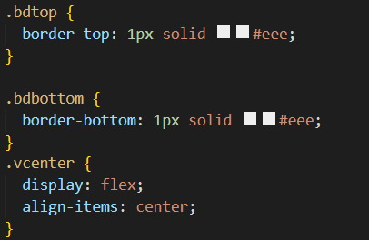

#### 渲染一级权限

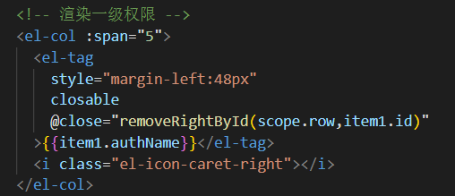
使用el-tag标签，好看一点，并添加可删除的属性，删除时调用removeRightById方法
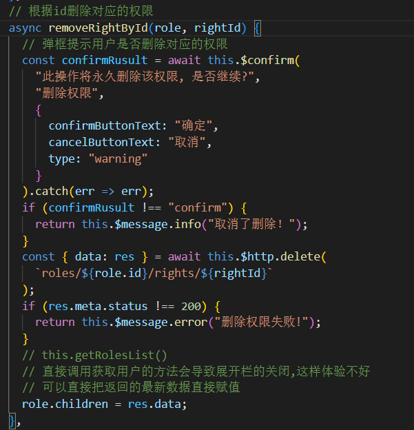
首先弹出一个弹框询问用户是否确认删除该权限，确认删除后向后端发送delete请求，删除成功将新的权限列表复制到当前行的数据。数据更新就会重新渲染
为了更直观的表示多级权限的关系，可以使用icon图标加一个小箭头

#### 渲染二级和三级权限

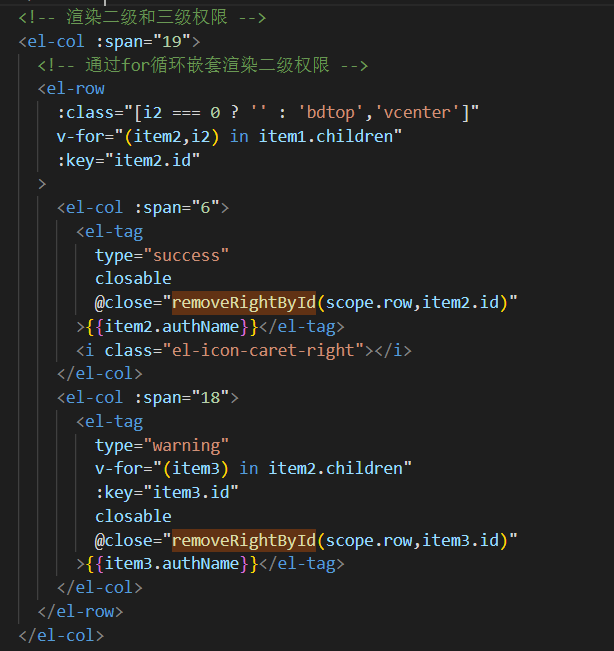
二级权限还不能全放在一行里，所以要新建一个行，里面有两列，一列是二级权限，二级权限后的三级权限可以全放一行，这样美观也尽可能的减少了页面空间的浪费
对二级和三级权限样式的修改和一级类似，只是不需要添加上边框了，不然会和一级权限的重合

#### 索引名称描述

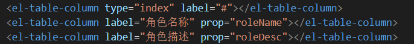
直接使用默认的就可以了

#### 分配权限

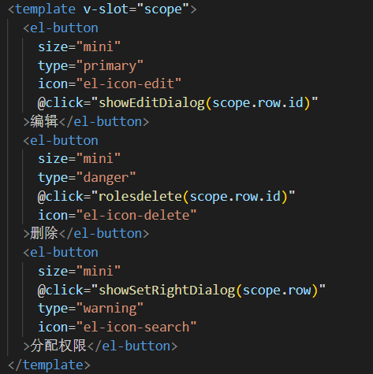
编辑和删除功能的实现逻辑和用户模块的类似，不多赘述
重点说一下分配权限的模块
点击按钮出现一个对话框并将这一行的值传入
showSetRightDialog方法
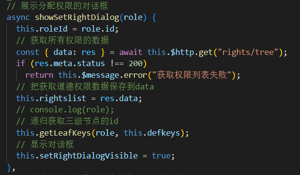
使用的事权限树的方式，所以调用后端能返回树的api，这后端写的好牛逼啊，啥功能都有。也可能是我太菜了
分配权限的对话框
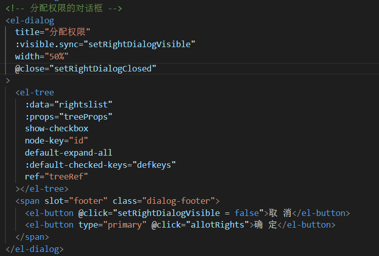
使用的是可选择的树形组件，即添加show-checkbox属性
将具体权限的id值唯一绑定给node-key
default-expand-all默认展开所有节点
然后我们需要默认勾选已经有的权限，default-checked-keys绑定defkeys数组。defkeys数组是请求的时候赋值的
点击确定调用allotRights方法
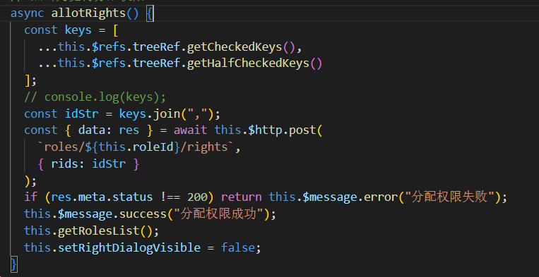
调用tree组件的getCheckedKeys，getHalfCheckedKeys获取以选择的和半选择的选框，然后通过扩展运算符将其添加到数组中。后端的接口要求的是一个用逗号连接的字符串，所以使用join方法已选的权限写入字符串
然后调用api发送请求就行

至此角色列表模块完成

### 源码

```vue
<template>
  <div>
    <!-- 面包屑导航 -->
    <el-breadcrumb separator-class="el-icon-arrow-right">
      <el-breadcrumb-item :to="{ path: '/home' }">首页</el-breadcrumb-item>
      <el-breadcrumb-item>权限管理</el-breadcrumb-item>
      <el-breadcrumb-item>角色列表</el-breadcrumb-item>
    </el-breadcrumb>
    <!-- 卡片视图 -->
    <el-card>
      <el-row>
        <el-col>
          <el-button type="primary" @click="addDialogVisible = true">添加角色</el-button>
        </el-col>
      </el-row>
      <!-- 角色列表区域 -->
      <el-table :data="rolelist" border stripe>
        <el-table-column type="expand">
          <template slot-scope="scope">
            <el-row
              :class="['bdbottom',i1===0?'bdtop':'','vcenter']"
              v-for="(item1, i1) in scope.row.children"
              :key="item1.id"
            >
              <!-- 渲染一级权限 -->
              <el-col :span="5">
                <el-tag
                  style="margin-left:48px"
                  closable
                  @close="removeRightById(scope.row,item1.id)"
                >{{item1.authName}}</el-tag>
                <i class="el-icon-caret-right"></i>
              </el-col>
              <!-- 渲染二级和三级权限 -->
              <el-col :span="19">
                <!-- 通过for循环嵌套渲染二级权限 -->
                <el-row
                  :class="[i2 === 0 ? '' : 'bdtop','vcenter']"
                  v-for="(item2,i2) in item1.children"
                  :key="item2.id"
                >
                  <el-col :span="6">
                    <el-tag
                      type="success"
                      closable
                      @close="removeRightById(scope.row,item2.id)"
                    >{{item2.authName}}</el-tag>
                    <i class="el-icon-caret-right"></i>
                  </el-col>
                  <el-col :span="18">
                    <el-tag
                      type="warning"
                      v-for="(item3) in item2.children"
                      :key="item3.id"
                      closable
                      @close="removeRightById(scope.row,item3.id)"
                    >{{item3.authName}}</el-tag>
                  </el-col>
                </el-row>
              </el-col>
            </el-row>
            <!-- <pre>{{scope.row}}</pre> -->
          </template>
        </el-table-column>
        <el-table-column type="index" label="#"></el-table-column>
        <el-table-column label="角色名称" prop="roleName"></el-table-column>
        <el-table-column label="角色描述" prop="roleDesc"></el-table-column>
        <el-table-column label="操作" width="300px">
          <template v-slot="scope">
            <el-button
              size="mini"
              type="primary"
              icon="el-icon-edit"
              @click="showEditDialog(scope.row.id)"
            >编辑</el-button>
            <el-button
              size="mini"
              type="danger"
              @click="rolesdelete(scope.row.id)"
              icon="el-icon-delete"
            >删除</el-button>
            <el-button
              size="mini"
              @click="showSetRightDialog(scope.row)"
              type="warning"
              icon="el-icon-search"
            >分配权限</el-button>
          </template>
        </el-table-column>
      </el-table>
    </el-card>
    <!-- 添加角色对话框 -->
    <el-dialog title="添加角色" :visible.sync="addDialogVisible" @close="addDislogClosed">
      <el-form :model="addRolesForm" :rules="addFormRules" ref="addRolesForm" label-width="100px">
        <el-form-item label="角色名称" prop="roleName">
          <el-input v-model="addRolesForm.roleName"></el-input>
        </el-form-item>
        <el-form-item label="角色描述" prop="roleDesc">
          <el-input v-model="addRolesForm.roleDesc"></el-input>
        </el-form-item>
      </el-form>
      <span slot="footer" class="dialog-footer">
        <el-button @click="addDialogVisible = false">取 消</el-button>
        <el-button type="primary" @click="addRolesUser">确 定</el-button>
      </span>
    </el-dialog>
    <!-- 编辑对话框 -->
    <el-dialog title="修改角色" :visible.sync="editDialogVisible" width="50%">
      <el-form :model="editRolesForm" :rules="editFormRules" ref="editFormRef" label-width="100px">
        <el-form-item label="角色名称" prop="roleName">
          <el-input v-model="editRolesForm.roleName"></el-input>
        </el-form-item>
        <el-form-item label="角色描述" prop="roleDesc">
          <el-input v-model="editRolesForm.roleDesc"></el-input>
        </el-form-item>
      </el-form>
      <span slot="footer" class="dialog-footer">
        <el-button @click="editDialogVisible = false">取 消</el-button>
        <el-button type="primary" @click="editFormInfo">确 定</el-button>
      </span>
    </el-dialog>
    <!-- 分配权限的对话框 -->
    <el-dialog
      title="分配权限"
      :visible.sync="setRightDialogVisible"
      width="50%"
      @close="setRightDialogClosed"
    >
      <el-tree
        :data="rightslist"
        :props="treeProps"
        show-checkbox
        node-key="id"
        default-expand-all
        :default-checked-keys="defkeys"
        ref="treeRef"
      ></el-tree>
      <span slot="footer" class="dialog-footer">
        <el-button @click="setRightDialogVisible = false">取 消</el-button>
        <el-button type="primary" @click="allotRights">确 定</el-button>
      </span>
    </el-dialog>
  </div>
</template>

<script>
export default {
  data() {
    return {
      // 所有角色列表数据
      rolelist: [],
      // 添加角色对话框的显示和隐藏
      addDialogVisible: false,
      // 编辑对话框的显示和隐藏
      editDialogVisible: false,
      // 分配权限对话框的显示和隐藏
      setRightDialogVisible: false,
      // 添加角色的表单数据
      addRolesForm: {
        roleName: "",
        roleDesc: ""
      },
      // 添加角色的表单验证规则
      addFormRules: {
        roleName: [
          { required: true, message: "请输入角色名称", trigger: "blur" }
        ],
        roleDesc: [
          { required: true, message: "请输入角色描述", trigger: "blur" }
        ]
      },
      // 编辑角色的表单数据
      editRolesForm: {},
      // 编辑角色的表单验证规则
      editFormRules: {
        roleName: [
          { required: true, message: "请输入角色名称", trigger: "blur" }
        ],
        roleDesc: [
          { required: true, message: "请输入角色描述", trigger: "blur" }
        ]
      },
      // 获取权限的列表
      rightslist: [],
      // 树形控件的属性绑定对象
      treeProps: {
        label: "authName",
        children: "children"
      },
      // 默认选中的节点的id
      defkeys: [],
      // 即将分配角色的id
      roleId: ""
    };
  },
  created() {
    this.getRolesList();
  },
  methods: {
    // 获取角色列表
    async getRolesList() {
      const { data: res } = await this.$http.get("roles");
      if (res.meta.status !== 200)
        return this.$message.error("获取角色列表失败");
      this.rolelist = res.data;
      // console.log(res.data)
    },
    // 添加角色
    addRolesUser() {
      this.$refs.addRolesForm.validate(async valid => {
        if (!valid) return;
        const { data: res } = await this.$http.post("roles", this.addRolesForm);
        // console.log(res);
        if (res.meta.status !== 201) {
          return this.$message.error("添加角色失败!");
        }
        this.$message.success("添加角色成功!");
        this.getRolesList();
        this.addDialogVisible = false;
      });
      // console.log(this.addRolesForm)
    },
    // 清空添加角色对话框
    addDislogClosed() {
      this.$refs.addRolesForm.resetFields();
    },
    // 删除角色
    async rolesdelete(id) {
      const confirmRusult = await this.$confirm(
        "此操作将永久删除该角色, 是否继续?",
        "删除角色",
        {
          confirmButtonText: "确定",
          cancelButtonText: "取消",
          type: "warning"
        }
      ).catch(err => err);
      // 没有使用await
      if (confirmRusult !== "confirm") {
        return this.$message.info("已取消该删除操作");
      }
      this.$http.delete("roles/" + id).then(res => {
        const { data: response } = res;
        // console.log(response)
        if (response.meta.status !== 200) {
          return this.$message.error("该角色删除失败");
        }
        this.$message.success("该角色已经删除");
        this.getRolesList();
      });
    },
    // 得到修改用户的信息
    async showEditDialog(id) {
      const { data: res } = await this.$http.get("roles/" + id);
      if (res.meta.status !== 200) {
        return this.$message.error("查询角色失败!");
      }
      this.editRolesForm = res.data;
      // console.log(this.editRolesForm);
      this.editDialogVisible = true;
    },
    editFormInfo() {
      this.$refs.editFormRef.validate(valid => {
        if (!valid) return;
        this.$http
          .put("roles/" + this.editRolesForm.roleId, {
            roleName: this.editRolesForm.roleName,
            roleDesc: this.editRolesForm.roleDesc
          })
          .then(res => {
            if (res.data.meta.status !== 200) {
              return this.$message.error("修改角色失败!");
            }
            this.$message.success("修改角色成功!");
            this.getRolesList();
          });
        this.editDialogVisible = false;
      });
    },
    // 根据id删除对应的权限
    async removeRightById(role, rightId) {
      // 弹框提示用户是否删除对应的权限
      const confirmRusult = await this.$confirm(
        "此操作将永久删除该权限, 是否继续?",
        "删除权限",
        {
          confirmButtonText: "确定",
          cancelButtonText: "取消",
          type: "warning"
        }
      ).catch(err => err);
      if (confirmRusult !== "confirm") {
        return this.$message.info("取消了删除！");
      }
      const { data: res } = await this.$http.delete(
        `roles/${role.id}/rights/${rightId}`
      );
      if (res.meta.status !== 200) {
        return this.$message.error("删除权限失败!");
      }
      // this.getRolesList()
      // 直接调用获取用户的方法会导致展开栏的关闭,这样体验不好
      // 可以直接把返回的最新数据直接赋值
      role.children = res.data;
    },
    // 展示分配权限的对话框
    async showSetRightDialog(role) {
      this.roleId = role.id;
      // 获取所有权限的数据
      const { data: res } = await this.$http.get("rights/tree");
      if (res.meta.status !== 200)
        return this.$message.error("获取权限列表失败");
      // 把获取道德权限数据保存到data
      this.rightslist = res.data;
      // console.log(role);
      // 递归获取三级节点的id
      this.getLeafKeys(role, this.defkeys);
      // 显示对话框
      this.setRightDialogVisible = true;
    },
    // 通过递归的形式获取所有角色下三级权限的id
    getLeafKeys(node, arr) {
      // 如果当前node节点不包含children，则是三级节点
      if (!node.children) {
        return arr.push(node.id);
      }
      node.children.forEach(element => {
        this.getLeafKeys(element, arr);
      });
    },
    // 监听分配权限对话框的关闭事件
    setRightDialogClosed() {
      this.defkeys = [];
    },
    // 点击为觉得分配权限
    async allotRights() {
      const keys = [
        ...this.$refs.treeRef.getCheckedKeys(),
        ...this.$refs.treeRef.getHalfCheckedKeys()
      ];
      // console.log(keys);
      const idStr = keys.join(",");
      const { data: res } = await this.$http.post(
        `roles/${this.roleId}/rights`,
        { rids: idStr }
      );
      if (res.meta.status !== 200) return this.$message.error("分配权限失败");
      this.$message.success("分配权限成功");
      this.getRolesList();
      this.setRightDialogVisible = false;
    }
  }
};
</script>

<style lang="less" scoped>
.el-tag {
  margin: 7px;
}
.bdtop {
  border-top: 1px solid #eee;
}

.bdbottom {
  border-bottom: 1px solid #eee;
}
.vcenter {
  display: flex;
  align-items: center;
}
</style>
```
