# 零基础本地部署大语言模型（LLM）

## 前置准备

### 安装python

首先区分python和anaconda，python是一种编程语言，ananconda可以理解成一个环境管理工具。它提供的conda可以帮助我们建立多个不同的python虚拟环境。当我们手上有多个不同的项目需要跑的时候，需要的python依赖包可能不一样。这个时候就需要使用conda来创建多个python环境。否咋可能会出现A项目的某依赖包需要的版本是1.0，B项目的某依赖包需要的版本是2.0，二者不兼容，所以两个项目无法在同一个python环境里运行。

然后开始安装python，可以直接装anaconda，装完anaconda他就会自带python。去anaconda官网下载[Anaconda](https://www.anaconda.com/download)

下载完了安装，一路next就可以了。然后进到你安装anaconda的目录里
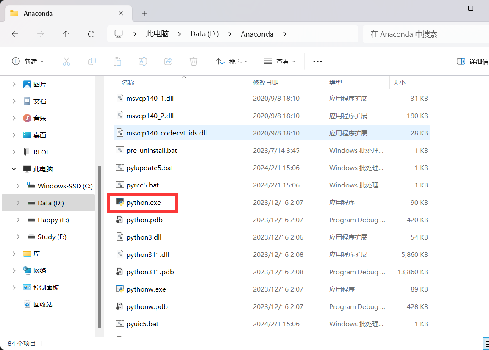

可以看到根目录里有python，将anaconda的路径加到环境变量里，环境变量不知道的可以百度，这里不多赘述。
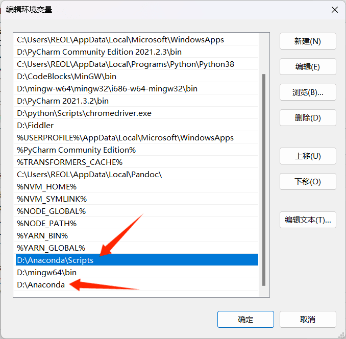
根目录加到环境变量里是为了可以在终端直接运行python，即下面的箭头指向的路径；根目录后面价格scripts加到环境变量里是为了能在终端里激活虚拟环境，即上面的箭头指向的路径。

加完了之后win+r，然后cmd打开一个终端，执行

```shell
activate
```

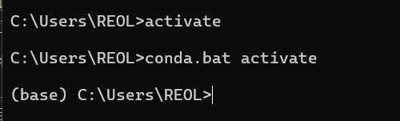
可以看到本来前面是没有base的，执行完毕后就多了个base，这就是anaconda初识自带的python环境。

执行

```shell
conda info --env
```

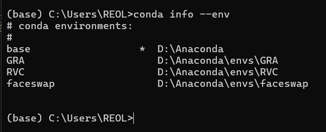
就可以查看当前已经创建的虚拟环境
执行

```shell
conda create -n [环境名] python=[版本]
```

就可以创建一个虚拟环境
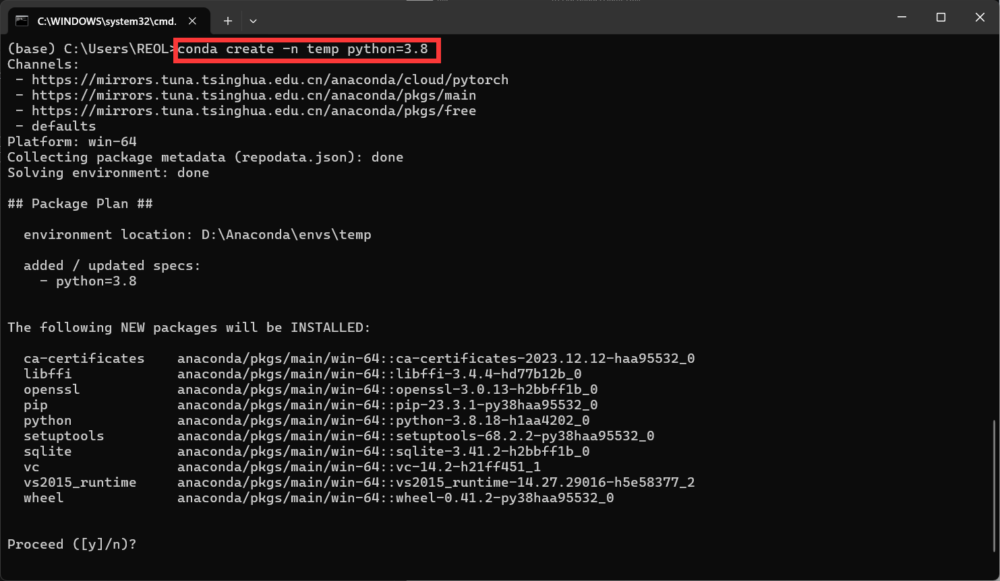
输入 y 确认安装，然后等待片刻。

如果执行后出现一大堆的warning，类似这种情况
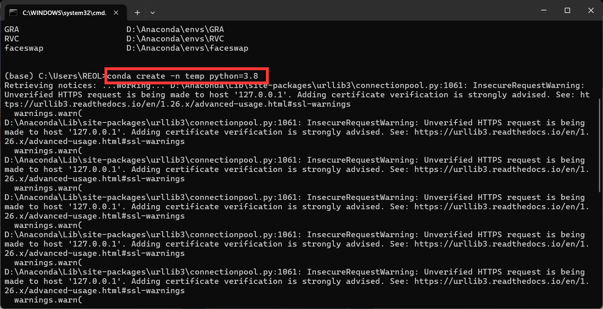
不用管他，只要能让你输入y确定安装就行，其他报错请百度
安装完毕长这样
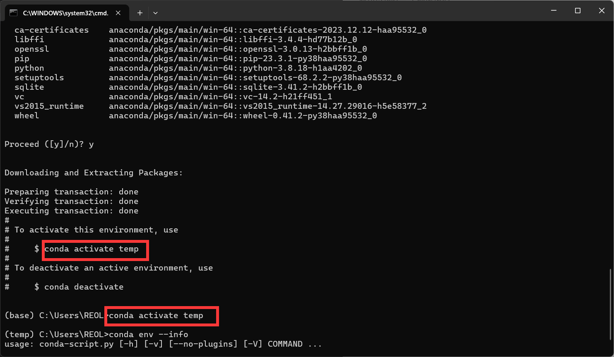
执行

```shell
conda activate [环境名]
```

就能进入创建的虚拟环境了。

至此anaconda或者说python安装完毕

### 安装git

git就是一个版本管理工具，简单的理解成你可以很方便的去代码托管平台github，gitee克隆（抄袭）别人的代码。github上不去的可能需要一些魔法，就是翻墙。

去git官网下载 [Git](https://git-scm.com/download/win) ，安装的是有记得把添加到环境变量的选项勾上，没有勾上的安装完了手动加到环境变量里面去。
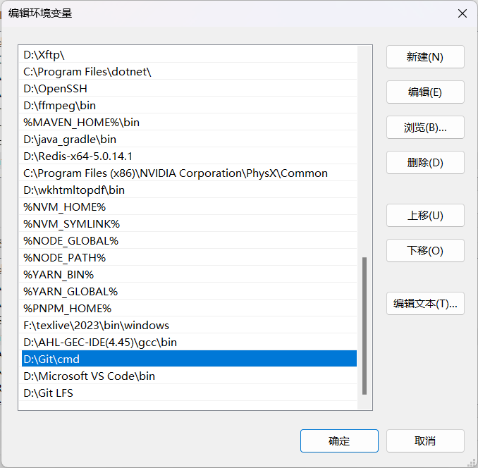
能在终端使用就行
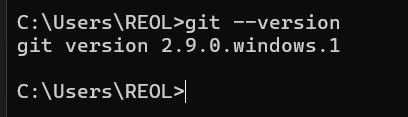

## 本地部署大语言模型

这里选择的模型是Chinese-LLaMA-Alpaca-2，首先简单介绍一下

llama模型是meta公司（ins，facebook那个）发布的一个大语言模型，alpaca是斯坦福在llama的基础上微调的模型。这俩都不支持中文，于是国内大佬自己训练了一个lora（可以理解成游戏mod），与alpaca合并后就有了Chinese-LLaMA-Alpaca。这里部署的是二代。部署一代需要手动合并lora（理解成手动给不支持中文的游戏打补丁），二代直接发布了合并好的模型（理解成官方汉化），更好部署了。

该项目的主页也写了如何本地部署，可以自己研究研究不同的部署方式。这里简单说其中一种。

去这个项目下载发布的模型
[Chinese-LLaMA-Alpaca-2](https://github.com/ymcui/Chinese-LLaMA-Alpaca-2?tab=readme-ov-file#%E6%A8%A1%E5%9E%8B%E4%B8%8B%E8%BD%BD)
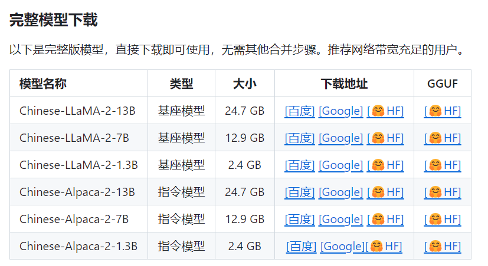

然后使用text-generation-webui部署这个模型，这是官方教程
[text-generation-webui](https://github.com/ymcui/Chinese-LLaMA-Alpaca-2/wiki/text-generation-webui_zh)

首先去text-generation-webui项目主页克隆整个项目,win+r，输入cmd打开一个终端，请注意默认打开终端的位置是在C盘的用户目录。

建议先打开文件管理器，进入到你想要存放项目的目录，然后在文件路径位置输入cmd
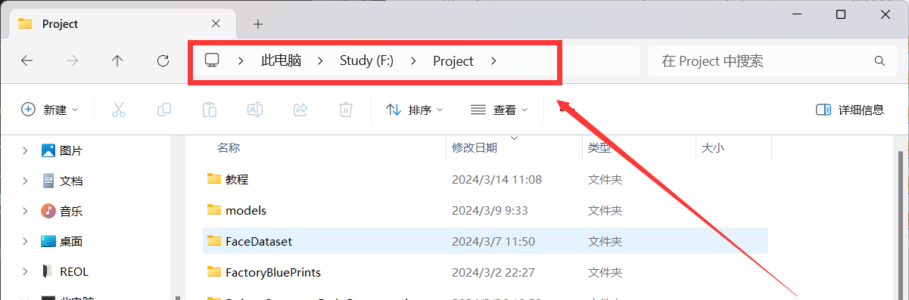
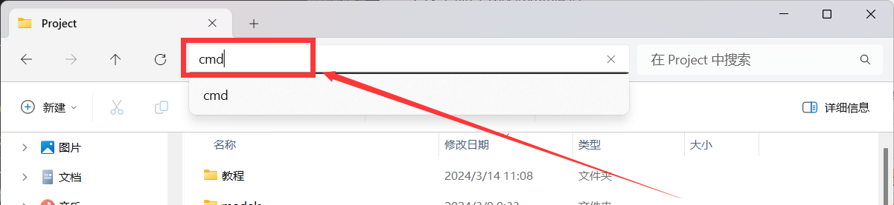
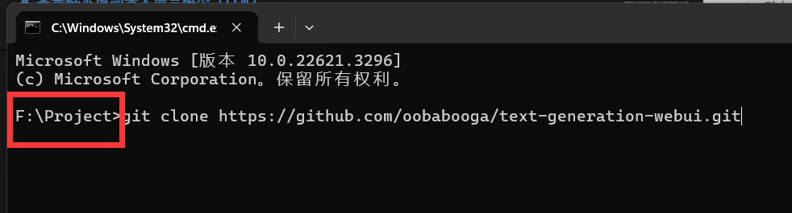

打开后执行以下命令

```git
git clone https://github.com/oobabooga/text-generation-webui.git
```

因为github服务器在国外，连不上多试几次，或者翻墙。

执行完毕进入text-generation-webui项目，里面有各种启动脚本
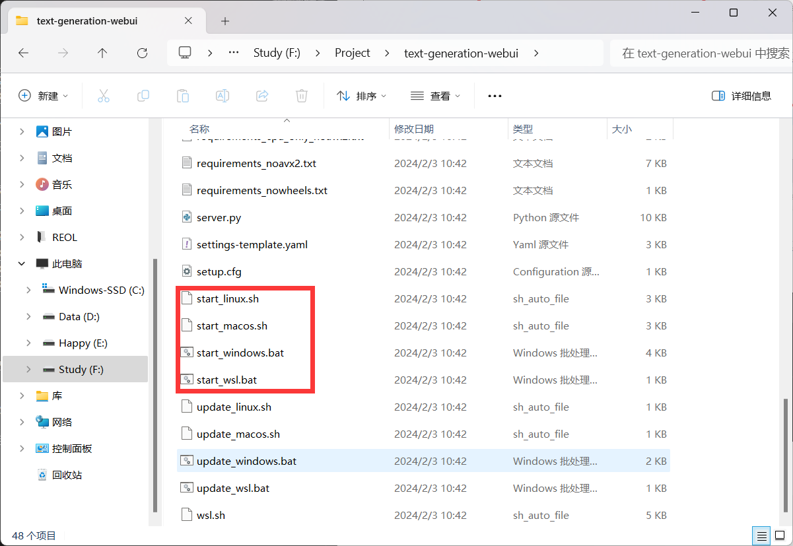。
想一步到位直接双击start_windows就好了，他会帮你装一个miniconda（和anaconda类似）并新建虚拟环境。但我推荐手动安装。
将这个项目在终端里打开
首先新建一个虚拟环境，执行

```shell
conda create -n llama
```

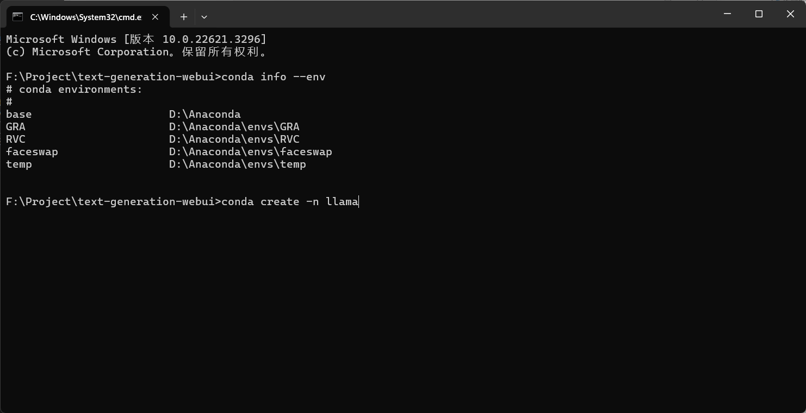
新建完毕后进入这个环境

```shell
conda activate llama
```

然后安装依赖

```shell
pip install -r requirements.txt
```

如果遇到这种情况，说明你梯子（科学上网的工具）没关
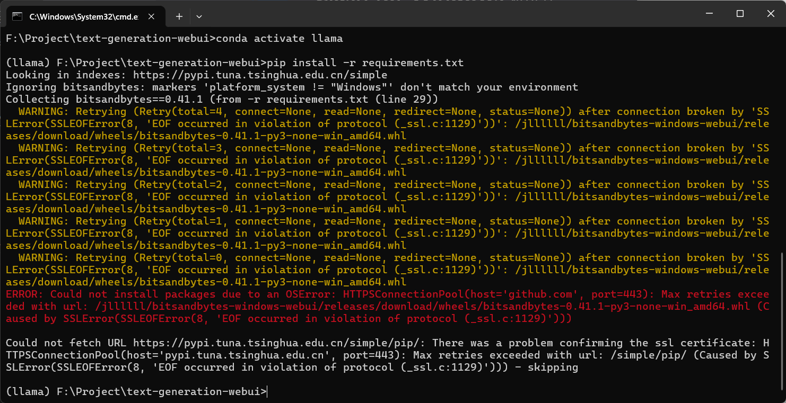
如果下载速度太慢请更改清华源
[参考教程](https://mirrors.tuna.tsinghua.edu.cn/help/pypi/)
安装完毕执行

```shell
python server.py
```

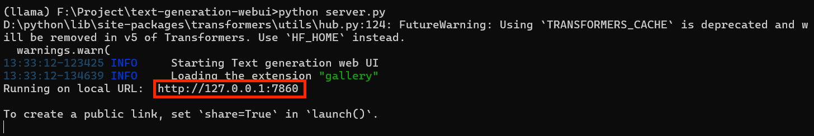
浏览器访问这个网址
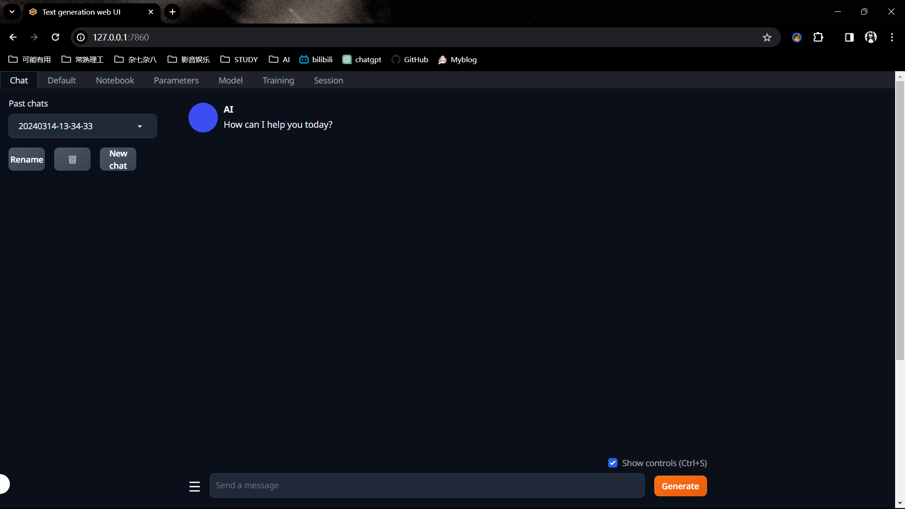
现在可以聊天了，首先加载模型

把你下载好的模型放到text-generation-webui\models里
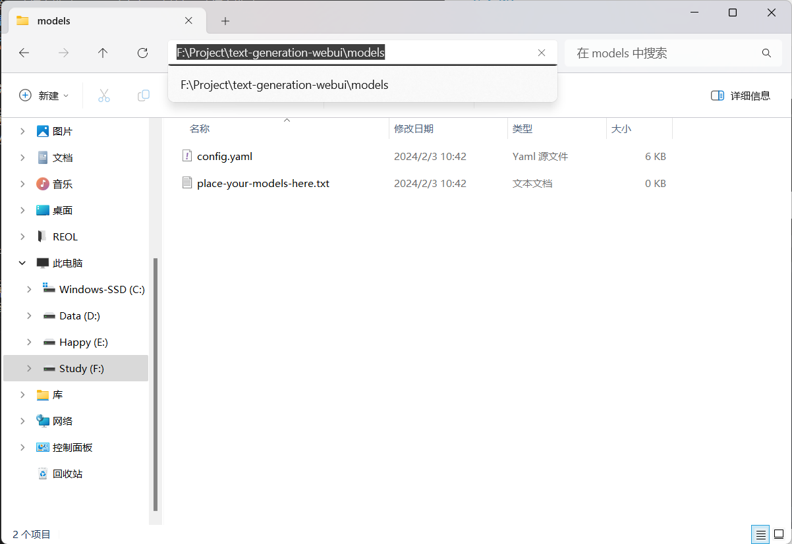
然后点击页面上的model选项
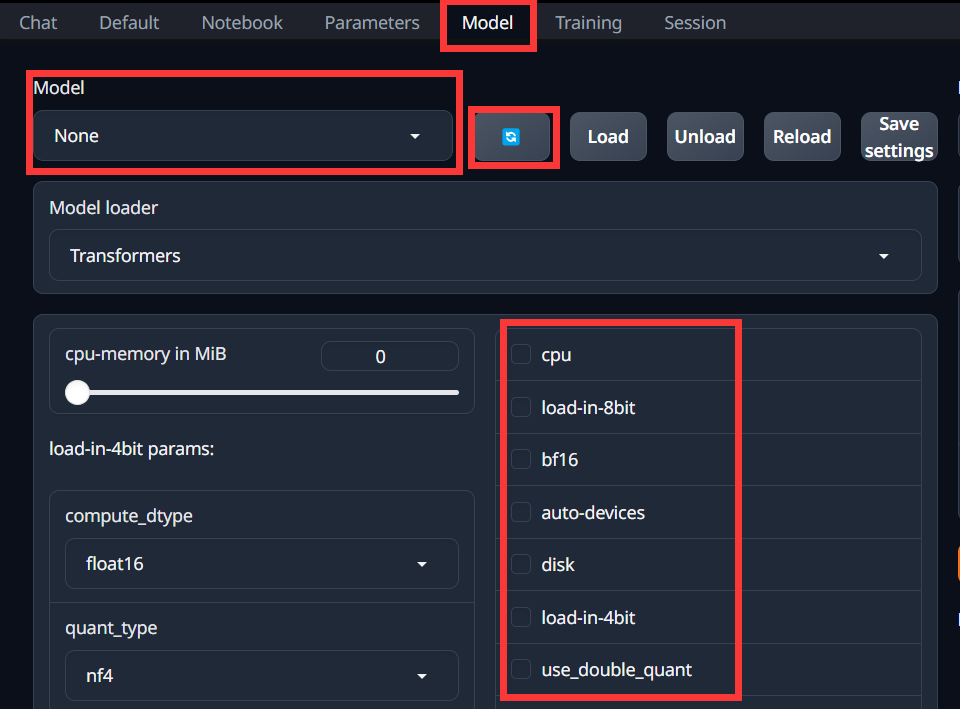
点蓝色的按钮可以刷新一下，然后就可以在下拉框选择你的模型了

如果你的显存不够，可以选择量化操作，即最下面红色方框的选项

这是不同参数模型量化后的大小
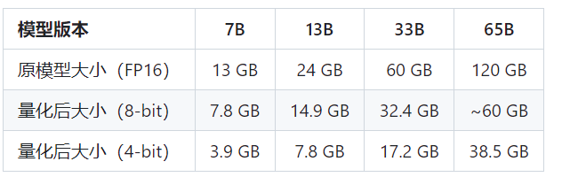
选择load-in-4bit，load-in-8bit等，根据自己的显卡配置来。

该项目进过几次更新，页面可能会有些许不同，不过总体而言当差不差。

选好了点击load，等待片刻，注意如果模型太大显存会炸。提示成功后回到chat界面，就可以聊天了。

根据模型的不同，支持的聊天方式不同
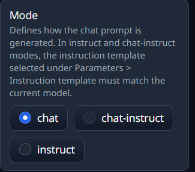
一个不行可以换成另一个

如果需要训练自己的lora，点击training选项
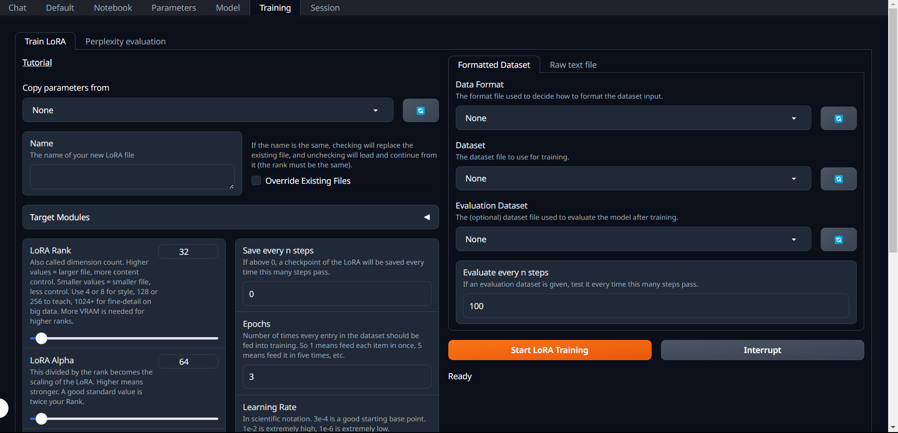
在左侧的Name处给自己的lora取个名字，右侧就是加载数据。可以是格式化的json文件，也可以是txt文本。
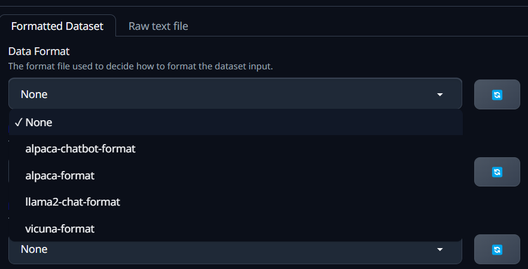
json文件的格式可在 text-generation-webui\training\formats 查看
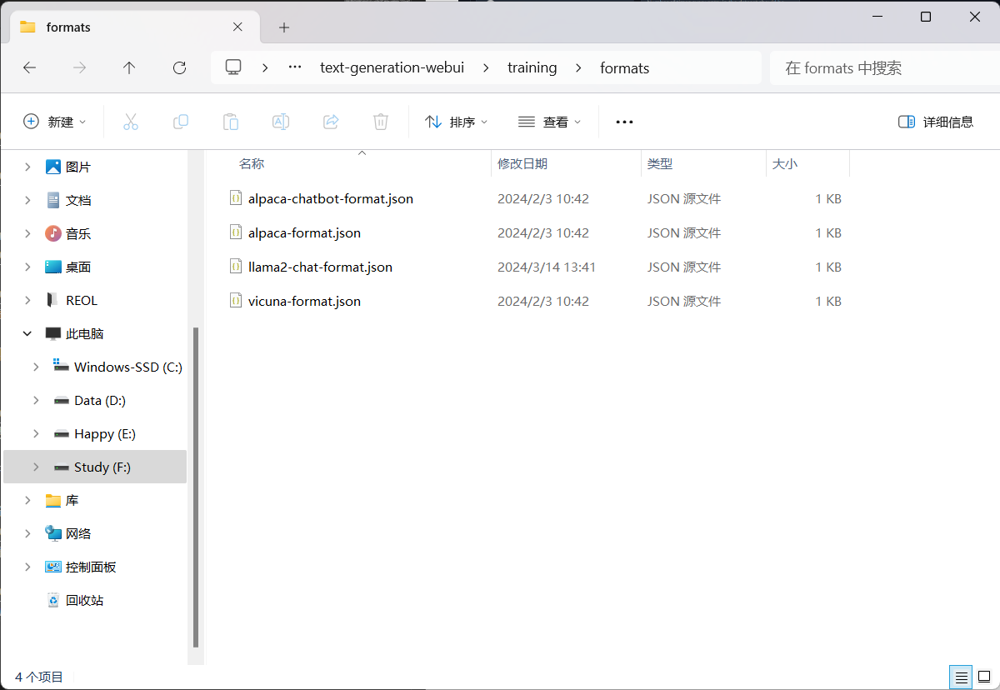
要训练的数据集请放在 text-generation-webui\training\datasets 下
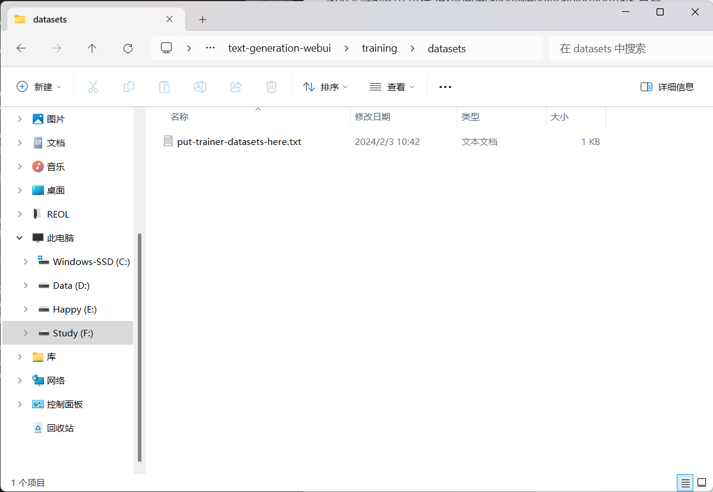
使用json就先选你json的文件格式，再选择你的数据集
使用txt就直接选数据集就行了
至于数据集从哪里来，就需要自己去网上找找，或者自己收集数据
json的格式都是规定好的我不多赘述，这里推荐txt的文件是一问一答的形式
所有的都设置好了，点击开始训练就行。注意你的显存，可能会爆。
