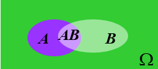
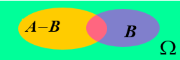
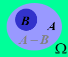
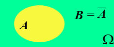
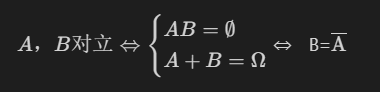
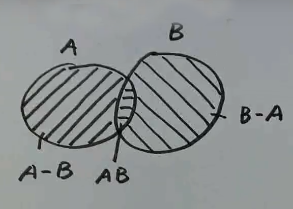

# 事件与概率

## 随机试验

E为一个试验，当E满足：

* 相同条件下可重复
* 试验的结果具有多样性；试验前所有可能结果已知
* 试验前不确定何种结果发生

满足以上三个条件的试验称为随机试验

如：

* 投币[正面，反面]
* 投骰子[1，2，3，4，5，6]

## 样本空间

E为随机试验，E的所有可能的基本结果而成的集合，称为E的样本空间，记为 **Ω**

如：扔骰子E  

* Ω = [1，2，3，4，5，6]
* A = [2，4，6]

A是一个事件，但不是一个基本事件

## 随机事件

E为随机试验，Ω为E的样本空间，Ω的子集称为随机事件，简称事件

* ∅⊂Ω
  * ∅--不可能事件

* Ω⊂Ω
  * Ω--必然事件

## 事件的关系运算

### 运算

设A，B为事件

* 和
  * A或者B发生的事件称为A，B的和事件，记A+B
  
  

* 积
  * A和B同时发生的事件称为A，B的积事件，记为AB（或者A∩B）
  
  

* 差  
  * A发生且B不发生的事件称为A与B的差事件记作A-B     

  

* 补
  * A不发生的事件，称为A的补事件，记作$\overline{\text{A}}$
  
  

## 关系

设A，B两个事件

* 包含
  * 若A发生，则B一定发生，成A包含于B，记作A$\subset$B

  

* 相等
  * 若A发生，则B一定发生；反之，若B发生，则A一定发生，即A$\subset$B且B$\subset$A，称A，B相等，记作A=B
* 互斥（不相容）&emsp;A，B不能同时发生，称A，B互斥  
  A，B互斥⇔AB=∅

  

* 对立
  * A，B不能同时发生，且至少一个发生，称A，B对立

  

  

Notes:

* A = ( A - B ) + AB
* A + B = ( A - B ) + AB + ( B - A)

# 概率、概率的基本公式

## 概率的定义

E为随机试验，Ω为样本空间，∀A⊂Ω，定义P(A)，若满足：

* ∀A⊂Ω，有P(A)≥0(非负性)
* P(Ω)=1(归一性)
* 设A~1~,A~2~,...,A~n~,...,两两互斥，有P(A~1~+A~2~+...)=P(A~1~)+P(A~2~)+...(可列可加性)

称P(A)为事件A的概率

注：

* P(∅)=0
  * 证明：取A~1~=A~2~=...=∅，A~1~,A~2~两两互斥  
  P(∅+∅+...)=P(∅)+P(∅)+...
  ⇒P(∅)=P(∅)+P(∅)+...  
  ∵P(∅)≥0
  ∴P(∅)=0

* 有限可加性 ，设A~1~,A~2~,...,A~n~两两互斥，则有P(A~1~+A~2~+...A~n~)=P(A~1~)+P(A~2~)+...+P(A~n~)  
  * 证 ：
  令A~n+1~=A~n+2~==...=∅
  A~1~,A~2~,...,A~n~,...,两两互斥
  则P(A~1~+A~2~+...A~n~+...)=P(A~1~)+P(A~2~)+...P(A~n~)+...
  ⇒P(A~1~+A~2~+...A~n~)=(A~1~)+P(A~2~)+...P(A~n~)
* (补性质)A+$\overline{\text{A}}$=Ω，且A$\overline{\text{A}}$=∅  ，则P($\overline{\text{A}}$)=1-P(A)
  * 证
  ∵A$\overline{\text{A}}$=∅
  ∴P(A+$\overline{\text{A}}$)=P(A)+P($\overline{\text{A}}$)
  又∵A+$\overline{\text{A}}$=Ω
  ∴P(A+$\overline{\text{A}}$)=P(Ω)=1
  ⇒P(A)+P($\overline{\text{A}}$)=1
  ⇒P($\overline{\text{A}}$)=1-P(A)

## 概率的基本公式

### 减法公式

A=(A-B)+AB  
且A-B与AB互斥
∴P(A)=P(A-B)+P(AB)  
∴P(A-B)=P(A)-P(AB)  
又A=AΩ=A(B+$\overline{\text{B}}$)=AB+A$\overline{\text{B}}$
∵AB⊂B,A$\overline{\text{B}}$⊂$\overline{\text{B}}$
∴AB与A$\overline{\text{B}}$互斥
∴P(A)=P(AB)+P(A$\overline{\text{B}}$)
⇒P(A$\overline{\text{B}}$)=P(A)-P(AB)
∴P(A-B)=P(A$\overline{\text{B}}$)=P(A)-P(AB)

### 加法公式

A+B=(A-B)+AB+(B-A)
且A-B,AB,B-A两两互斥
∴P(A+B)=P(A-B)+P(AB)+P(B-A)
∵P(A-B)=P(A)-P(AB),P(B-A)=P(B)-P(AB)
∴

* P(A+B)=P(A)+P(B)-P(AB)
* P(A+B+C)=P(A)+P(B)+P(C)-P(AB)-P(AC)-P(BC)+P(ABC)
