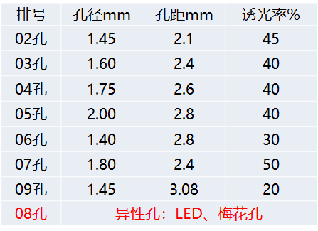

## 产品整体介绍

**背胶系列:**

* 车身贴
* 单透膜
* 冷裱膜
* 立体冷裱膜

**涂层系列：**

* 刀刮布涂层
* 网格布

**纺织品系列：**

* 旗帜布
* 双透部
* 油画布
* 棉花布

**贴合布系列：**

* 外光布
* 内光布

**弱溶剂产品系列：**

* PP
* PET灯片
* 相纸
* 反光材料

## 背胶类产品的特性及用途

### PVC膜分类

* 单分子PVC膜
* 高分子PVC膜
* 改色PVC膜
* 透明PVC膜
* 特种及功能性PVC膜

### 胶水分类

* 永久胶
* 可移胶
* 高粘胶
* 水胶
* 硅胶
* 热熔胶

### 纸的分类

* PEK硅纸
* CCK硅纸
* 格拉辛纸

### 产品特性及用途

#### 背胶系列：车身贴

**三层结构：** PVC面膜层+压敏胶层+淋膜&原纸层
**主要原料：** PVC面膜+胶水+离型纸
**主要应用：** 墙面广告、玻璃广告、三面翻广告、车身广告、商业看板

#### 背胶系列：冷裱膜

冷裱膜无需喷绘，使用的是透明永久胶
**三层结构：** PVC面膜层+压敏胶层+淋膜&原纸层
**主要原料：** PVC面膜+胶水+离型纸

#### 单透产品的特性及用途

**单透组成：**
单层单透：PVC白膜层+PVC黑膜层+胶水层+双淋冲孔层+底纸层
三层单透：PVC白膜层+PVC黑膜层+胶水层+双淋冲孔层+热熔胶层+原纸层
单层指的是底纸层，三层指的是热熔胶层+原纸层，原纸层是两层贴合在一起的

**单向透视：**

* 普通单透
* 高分子单透
* 印刷单透
* 彩色单透
* 反光单透
* 镭射膜单透
* 内贴单透
* PET、LED单透

**双向透视：**

* 双透艺术贴
* 透明单透贴
* 印刷单透贴

**单透摸孔径：**

## 贴合类产品的特性及用途

### 灯箱布

**简介：**
灯箱布是一种由两层PVC和一层高强度的网格布组成的灯箱招牌面料，分内打光和外打光两种。其主要生产方法有刀刮涂层法、压延法、贴合法(熔融法)。

**生产方式：**

* 涂层法
* 压延法
* 贴合法(熔融法)

**外打灯箱布：**黑白布、白白布、灰白布

* 冷贴NF
* 热帖PF

**内打灯箱布：**精品内光、普通内光、PET内光、细网内光布

* 冷贴NB
* 热帖PB

**双喷灯箱布：**夹黑双喷布，顾名思义，中间有夹黑层，可两面喷绘不同广告进行宣传，提高产品的附加值；

### 刀刮布

刀刮布工艺是将液态PVC浆料用若干反刮刀均匀的乔涂于基布的正反两面，然后通过烘干工艺使其完全结合成一个整体，之后冷却成形。
两次刮涂：1、正反面刮涂通过辊式风箱固化，2、第二次进行刮涂通过卧式风箱固化出成品

### 篷布

是一种高强度、具有良好韧性及柔软程度的防水材料，带聚氨酯涂层的涤纶或制作成聚乙烯类塑料。
**工艺类别：**

* 直帖法
* 网布浸浆热帖法
* 全涂刮法

### 网格布

网格布是以中碱或无碱玻纤维纱织造，经耐碱高分子乳液涂覆的玻纤。
经编网布+PVC浆料=网格布成品

### 反光膜

是一种已制成薄膜可直接应用的逆反射材料（光学原理）。 利用玻璃珠技术，微棱镜技术、合成树脂技术，薄膜技术和涂敷技术和微复制技术制成。通常颜色有白色、黄色、红色、绿色、蓝色、棕色、橙色等以及荧光系列。

**分类：**

* 背胶反光膜
* 背胶反光晶格
* 布基反光晶格

## 涂层类产品特性及应用

### 纺织布

**分类：**墙布/墙贴、油画布/棉画布、展架布、内光布、外光布、热升华布、

## 综合类产品特性及应用

### 膜类

1. 静电膜
2. 窗花贴
3. 刻字贴

### 纸类

1. 相纸
2. 墙纸

### 涂层类

1. 灯片
2. PP
